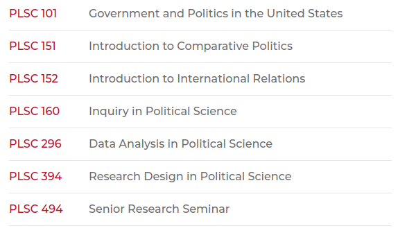
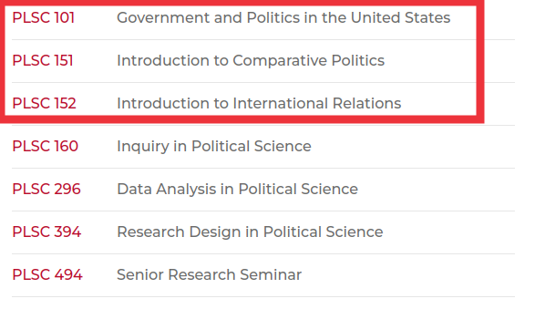
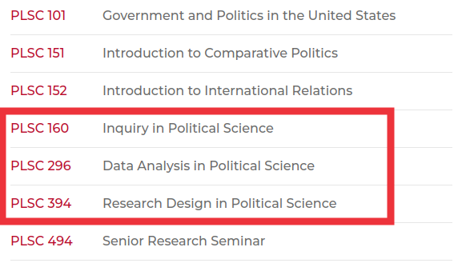
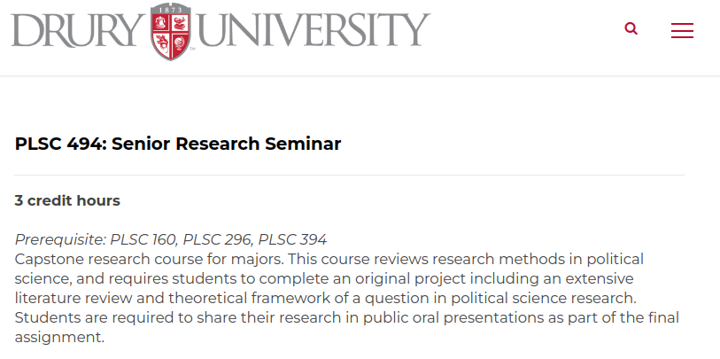
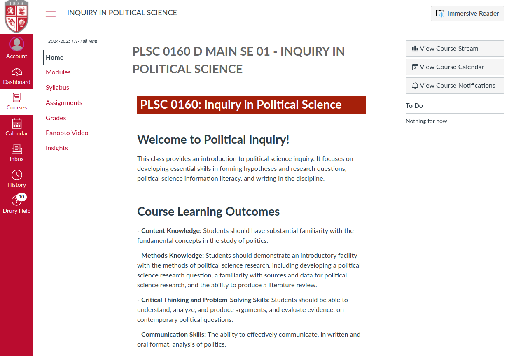
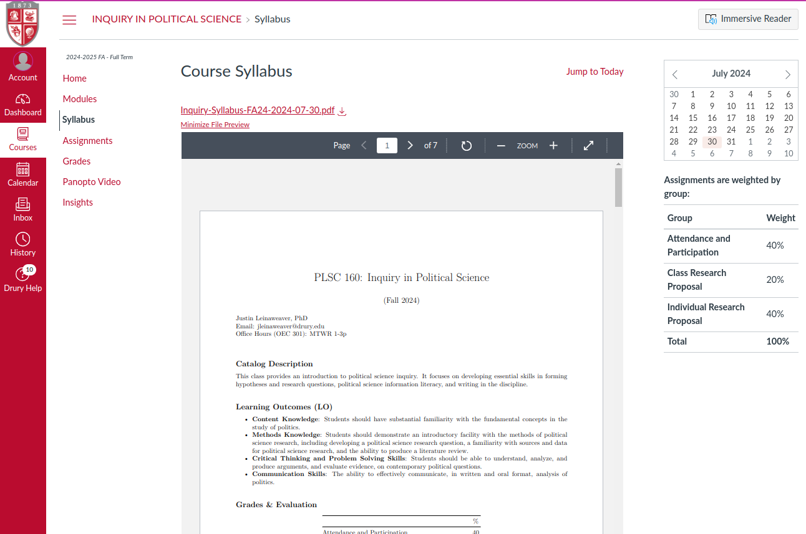

## Today's Agenda {background-image="Images/Background-Rally_v2.png" .center}

```{r}
# background-size="1920px 1080px"
library(tidyverse)
library(readxl)
```

<br>

::: {.r-fit-text}

Welcome to PLSC 160: Inquiry in Political Science

:::

<br>

<br>

::: r-stack
Justin Leinaweaver (Fall 2024)
:::

::: notes
Prep for Class

1. Update attendance list before class

<br>

Welcome all!

- SLIDE: This is a good crew, so let's dive straight in befor we talk about the class

:::


## Introductions {background-image="Images/Background-Rally_v2.png"  .center}

<br>

::: {.r-fit-text}

1. Name

2. How do you "follow" the news?

3. What news stories have your attention?

:::

::: notes

*ON BOARD*

While you introduce yourselves, I'll take notes!

- We'll use this as a chance to make two lists

<br>

1. Sources: Help us build a list of specific news sources you follow or often see stories from

2. News: What specific news items have been capturing your attention?
    - Not just "the election" but what specific aspects or events tied to it have caught your attention?

<br>

My turn!

- I'm Dr. Leinaweaver.

- I have the news diet of a crazy person
    - Daily: WSJ, NYT, Washington Post, News-Leader and the SGF Daily Citizen
    
    - Plus Foreign Policy magazine and political science journals...

- *add a recent news story to the list*

<br>

Before we discuss these two lists, let's talk about why you're here!

:::


## Required Courses in PLSC {background-image="Images/Background-Rally_v2.png"  .center}

<br>

```{r, fig.align='center'}

```

::: notes

All poli sci majors must complete this set of required courses

:::


## Required Courses in PLSC {background-image="Images/Background-Rally_v2.png"  .center}

<br>

```{r, fig.align='center'}

```

::: notes

The first three introduce you to the different specialties within political science

<br>

**For those who have taken 101, what kinds of questions were you pushed to consider in that class?**

<br>

**How about in comparative? Key questions explored?**

<br>

**And in IR what were the big questions you explored?**

:::


## Required Courses in PLSC {background-image="Images/Background-Rally_v2.png"  .center}

<br>

```{r, fig.align='center'}

```

::: notes

The second three courses, inquiry, data analysis and research design, are designed to teach you how to do your own research

<br>

Not just to read and consider how others have asked and answered big questions, but how YOU can ask and answer them too

<br>

These are the classes designed to teach you to be a practicing social scientist.

:::


## Required Courses in PLSC {background-image="Images/Background-Rally_v2.png"  .center}

<br>

```{r, fig.align='center'}

```

::: notes

All of that, plus the electives you will choose for yourself, sum together in the Senior Research Seminar

- The Fall of your senior year you will design and execute a research project!

<br>

SLIDE: So, let's talk about what we do in this class

:::


## PLSC 160: Inquiry in Political Science {background-image="Images/Background-Rally_v2.png"  .center}

<br>

::: {.r-fit-text}

Designing a "good" research proposal requires:

- A compelling research question,

- A foundation in the academic literature, and 

- A clear theoretical story to test
:::

::: notes

Inquiry in Political Science is meant to teach you how to set up a research project with these three components

<br>

You will learn to:

- Develop and refine research questions,

- Identify the extent of our knowledge on those questions,

- Develop theoretical answers to those questions, and

- To communicate your research plans to others

<br>

SLIDE: Let's practice this process so you can see better what I'm talking about!

:::


## Brainstorming a Research Project {background-image="Images/Background-Rally_v2.png" .center}

::: {.incremental}
1. Pick one news story and describe precisely what happened that caught your attention

2. Phrase what happened as a question

3. Give us one possible answer for the question

4. What evidence in the world would you expect to find if your answer was correct?

5. Which sources from our list would you use for gathering this evidence? Why?

:::

::: notes

Let's try this one time, working together as a class

- *5 prompts, track choices ON BOARD*

- Prompt 3: In pairs, propose an answer to the question and explain WHY you think so (e.g theorizing) 

<br>

SLIDE: Discuss the results...
:::


## Brainstorming a Research Project {background-image="Images/Background-Rally_v2.png" .center}

1. Pick one news story and describe precisely what happened that caught your attention

2. Phrase what happened as a question

3. Give us one possible answer for the question

4. What evidence in the world would you expect to find if your answer was correct?

5. Which sources from our list would you use for gathering this evidence? Why?

::: notes

We'll spend the semester unpacking this exercise and helping you better understand these steps, but in short we just:

- Designed a research question focused on a specific outcome of interest

- Designed a theory meant to explain why that outcome happened, 

- Proposed testable implications for your theory (e.g. hypotheses), and

- Evaluated available sources of data for testing your theory

<br>

**In broad strokes, does this make sense?**

<br>

Let's practice this again!

- **Which story should we focus on?**

<br>

Pair off and do this exercise through the five prompts

- Get ready to report back!

<br>

*REPORT BACK and DISCUSS each*

- Make sure to note that even working from the same story we should get very different operationalizations of the outcome AND theoretical stories!

:::


## PLSC 160: Inquiry in Political Science {background-image="Images/Background-Rally_v2.png"  .center}

<br>

::: {.r-fit-text}

Designing a "good" research proposal requires:

- A compelling research question,

- A foundation in the academic literature, and 

- A clear theoretical story to test
:::

::: notes

Congrats to all, you are know thinking like scientific researchers!

- Once you learn to think like this you will see research questions, theories and evidence quality EVERYWHERE YOU LOOK!

<br>

Even more importantly, learning to think in terms of research quality will also make you a better consumer of the news 

- As you learn how tenuous and difficult it is to produce knowledge you will, hopefully, become much more careful in the conclusions you draw about the world

- And you will come to demand more from the sources you rely on

<br>

SLIDE: Let's talk about the design of the class

:::


## All Supporting Material is on Canvas  {background-image="Images/Background-Rally_v2.png"  .center}

```{r, fig.align='center'}

```

::: notes
Everybody log into Canvas with me and let's get oriented in our class infrastructure!

<br>

*Log into Canvas, set to student view and step them through the main pages*

- Home page,

- Grades,

- Assignments,

- Modules (with readings and assignment for Thursday)
:::


## The answer is in the syllabus   {background-image="Images/Background-Rally_v2.png" .center}

```{r, fig.align='center'}

```

::: notes

Everybody open the syllabus and let's hit the highlights!

- LOs

- Grade composition

- Attendance cliff (> 3 unexcused absences)

- Excused absence coming up? **It is your responsibility to email me BEFORE the absence in order to receive a make-up assignment.**

- Participation points

- Paper requirements: APA, submitted on Canvas, NO AI TOOLS

- Weekly plan (should essentially match the modules on Canvas)

<br>

**Any questions on our aims for the semester or my expectations for you as represented by the syllabus?**

<br>

Please keep me in the loop this semester!

- I genuinely want you to make progress on our learning outcomes

- So, if things are getting rough for you please come talk to me.

- I will always offer you flexibility in the face of struggle IF YOU COME TO ME BEFORE DEADLINES HAVE PASSED!

<br>

**Questions on this?**

:::


## For Next Class {background-image="Images/background-blue_triangles.jpg" .center}

<br>

### What do you have to have completed before our next class?

::: notes

**Check the syllabus and Canvas modules and report back!**

<br>

1. Arbesman (2012) Chapter 1

2. Donovan and Hoover (2014) Chapter 2

3. ASSIGNMENT: Find an example from a recent news story that asserts a NEW "fact" about the political world that you are confident is true (avoid overlapping submissions). 
    1. What is the NEW "fact"? 
    2. Provide an APA citation to the evidence 
    3. Explain why your confidence in the NEW fact is high. Try to draw connections between your evaluation and the ideas proposed in the assigned readings for today.

<br>

**Questions on the assignment?**
:::
