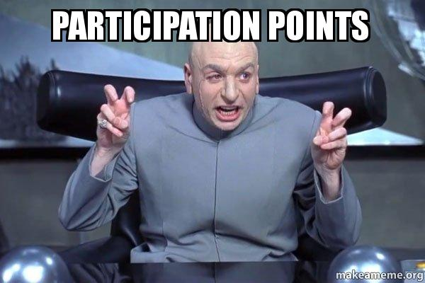
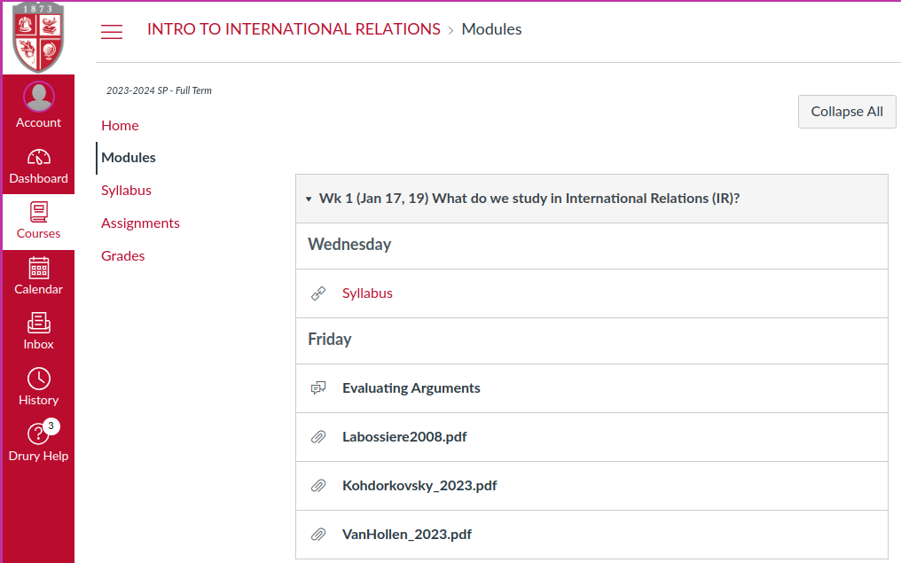
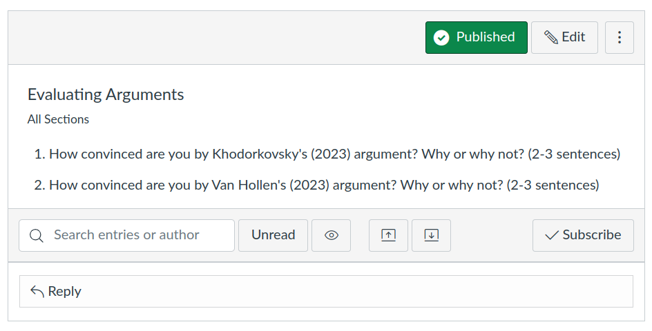

## Inquiry in Political Science {background-image="Images/Background-Rally_v2.png" .center}

```{r}
# background-size="1920px 1080px"
library(tidyverse)
library(readxl)
```

<br>

::: {.r-fit-text}
Make a list of **positive** and **negative** things the US has done on the world stage in the last 20 years.
:::

<br>

::: r-stack
Justin Leinaweaver (Fall 2024)
:::

::: notes
Prep for Class

1. Update attendance list before class

2. Make sure this week's modules visible in Canvas

<br>

*As students come in*

Welcome all.

- Sit down, introduce yourself to the people around you and get chatting about my prompt on the board.

- Build two lists as a group!

<br>

*ON BOARD*

### Ok, what is on your lists?

- SHARE and DISCUSS

<br>

**SLIDE**: Let's make sure we're all in the right place!
:::


## Introductions {background-image="Images/background-teal4.png"  .center}

<br>

1. Name

2. Year in school

3. Major

4. Earliest memory of a "big" international event

::: notes

1. Name: I'm Dr. Leinaweaver.

2. Year in school: 12th year at Drury

3. Major: Political scientist with primary research interests in international policy-making and problem-solving

4. Earliest memory? Berlin wall coming down and finding out our world map had to change. Kind of blew my mind.

<br>

### Your turn!

<br>

**SLIDE**: Back to the board!
:::


## On balance, has the US been a net positive or negative influence on the world over the last 20 years? {background-image="Images/background-teal4.png" .center}

::: notes

All of this adds up to a big, tough to handle question.

- I don't want to pretend our lists on the board are comprehensive or that this question isn't crazy reductive.

<br>

However, I'd like to take this opportunity to get a sense of how our class thinks about the role of the US in the world BEFORE we start our work this semester.

### So, what do you think?

:::


## {background-image="Images/01_1-international-certificate.jpg"}

::: notes

Welcome to International Relations (IR).

<br>

Our job this semester is to analyze "politics" happening at the international level.

- What does that mean? We'll get there!

<br>

Today's Agenda: Set up our class and plan for the semester
:::


## Learning Outcomes {background-image="Images/background-teal4.png"  .center}

::: {.incremental}
- LO 1: Learn about the big ideas and debates of IR scholars

- LO 2: Learn to use the tools of IR scholars to explain events

- LO 3: Use the tools to explain international political events

- LO 4: Write convincing arguments
:::

::: notes

Big picture, we have four learning outcomes this semester.

- All four are in the syllabus, but let me simplify them for you.

<br>

1. Content Knowledge
    - Learn the big ideas and basic definitions you need to explain international political events.

2. Methods Knowledge
    - Learn to use the tools of social scientists for analyzing international political events.

3. Critical Thinking & Problem Solving Skills
    - Practice applying social science tools to solve big problems and answer important questions.

4. Communication Skills
    - Practice writing logical, clear, credible and critical arguments so good that they will convince smart people you are right!

<br>

### Everybody good with these?

<br>

**SLIDE**: To make progress on these LOs I've divided the semester into four sections.

:::


## Semester Outline: Section 1 {background-image="Images/background-teal4.png" .center}

<br>

**Arguments, Evidence and International Relations**

- Making logical arguments,

- Testing those arguments scientifically, and

- Learning to think in terms of models

::: notes

Section 1 sets us up for the semester.

:::


## Semester Outline {background-image="Images/background-teal4.png" .center}

<br>

1. Arguments, Evidence and International Relations

2. Why Are There Wars?

3. Why is it so Hard to Cooperate With Other Countries?

4. What is the Future of Transnational Politics and IR?

::: notes

Alright, so that's our plan for the semester.

### Questions on this?

:::


## {background-image="Images/01_1-newspapers.jpg"}

::: notes

We will kick off most classes with current events discussions.

- This REQUIRES you to follow global news!

<br>

**Part of your job in this class is to keep up with international current events!**

- Skim the international section of a good news site everyday.

- Let's make sure we always have current events we can draw on in our discussions!
:::


## Course Grade {background-image="Images/background-teal4.png"}

```{r}
tibble(
  col1 = c("Participation", "Argument Paper 1", "Argument Paper 2", "Argument Paper 3", "Total"),
  col2 = c("", "(Feb 9)", "(Mar 22)", "(Final Exam)", ""),
  col3 = c(rep(25, 4), 100)
) |>
  kableExtra::kbl(align = c("l", "c", "c"), col.names = c("", "", "%")) |>
  kableExtra::kable_styling(font_size = 50) |>
  kableExtra::column_spec(1, width = "11em") |>
  kableExtra::column_spec(2, width = "7em") |>
  kableExtra::row_spec(c(0, 5), bold = TRUE, background = "#b3ccff")
```

::: notes
Course grade is pretty simple.

- Four equal pieces because being here and being engaged is as important to me as you learning to write convincing academic arguments.

<br>

Let's talk attendance and participation.
:::


## The Attendance Cliff {background-image="Images/background-teal4.png"}

```{r, fig.align='center'}

```

::: notes
NOTE: This is an intro class, don't rush this!!!

<br>

My attendance policy is simple.

- The only way I can ensure everyone makes progress on the LOs is by being in class and doing the work.

- This means I have to make sure you are here!

<br>

To help encourage you I use an attendance cliff.

- Anyone with more than FOUR unexcused absences in the semester cannot earn higher than a ‘C’ in the course

- Regardless of grades earned on other assignments.

<br>

### Questions on this?
:::


## Keep me in the loop! {background-image="Images/background-teal4.png"}

```{r, fig.align='center'}
knitr::include_graphics("Images/01_1-office_space.jpg")
```

::: notes
What if you have an excused absence coming up?

- **It is your responsibility to email me BEFORE the absence in order to receive a make-up assignment.**

- Easy peasy

<br>

This is also the place where I say to you, whatever is going on that might keep you out of class, please keep me in the loop. 

- I genuinely want you to make progress on our learning outcomes

<br>

So, if things are getting rough for you please come talk to me.

### I will always offer you flexibility in the face of struggle IF YOU COME TO ME BEFORE DEADLINES HAVE PASSED!

<br>

### Questions on this?
:::


## {background-image="Images/background-teal4.png"}

```{r, fig.align='center'}

```

::: notes
Ok, so I've got you coming to class now how do I make sure you're engaged?

- Participation points!

<br>

Basically, if you:

- Get to class on time,

- Have the materials you need to work, and

- Submit all daily required assignments BEFORE class,

You'll be good to go and these are easy free points.

<br>

Before most classes we will have a reading and a discussion question.

- You must submit your answer to that question on our Canvas discussion board BEFORE class begins to earn your participation point.

- The syllabus is marked for all class sessions that have a pre-class assignment

<br>

### Important note: Canvas will not tell you about discussion post requirements in your to do list. You have to keep track using the syllabus.

<br>

### Each participation point you lose will reduce your participation grade by 1/3 of a letter grade

### - e.g. A, A-, B+, B, B-, C+, etc.

<br>

### Questions on this?
:::


## {background-image="Images/01_1-matrix_meme.jpg"}

::: notes
Your first job is to download the syllabus from Canvas and read it carefully.

It includes detail on everything you need to know.
- Assignment deadlines
- Readings
- Drury policies
- Office hours

ALSO, I can see who downloaded it, so don’t delay!

<br>

We'll be using Canvas for submitting assignments, posting to the discussions and accessing the class readings.

- Let me know if you have trouble accessing our materials on Canvas.
:::


## {background-image="Images/background-teal4.png"}

```{r, fig.align='center'}

```

::: notes
Speaking of Canvas!

- ALL of the assigned readings and daily assignments are available on Canvas in the "Modules" section.

- I have organized the Modules by week of the semester to mirror the structure of the syllabus

<br>

The syllabus includes many web links, but if they don't work I have uploaded backups onto Canvas.

- ALL of the assigned readings should be on Canvas

- Please let me know BEFORE class if you ever can't find an assigned reading.

<br>

Here you can see your assignment for Friday.

- Labossiere is a short reading on evaluating the logic of an argument

- Then we have two short arguments that we can diagram and analyze

- The last item is the discussion board where you will submit your first participation assignment
:::


## {background-image="Images/background-teal4.png"}

```{r, fig.align='center'}

```

::: notes
So, after you complete the readings go to the discussion board and answer these two questions.
1. How convinced are you by Aseyev's (2022) argument? Why or why not?
2. How convinced are you by Kuo's (2023) argument? Why or why not?

<br>

I have found that requiring these pre-class questions sets us up for much livelier engagement in class!

### Questions on what I'm asking you to do?

- NOTE: The forum closes BEFORE class starts (9:59 am) so make sure to get these in!

<br>

Welcome to the class and let me know if you have any questions!
:::
