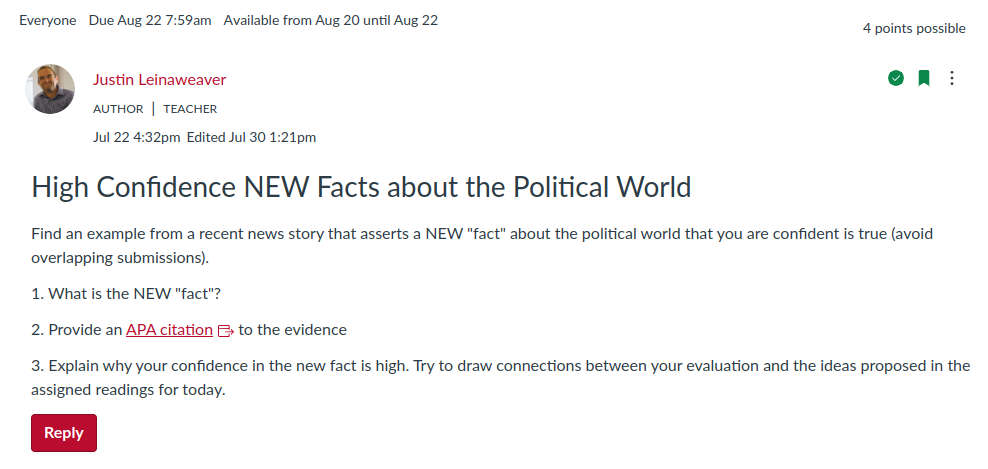
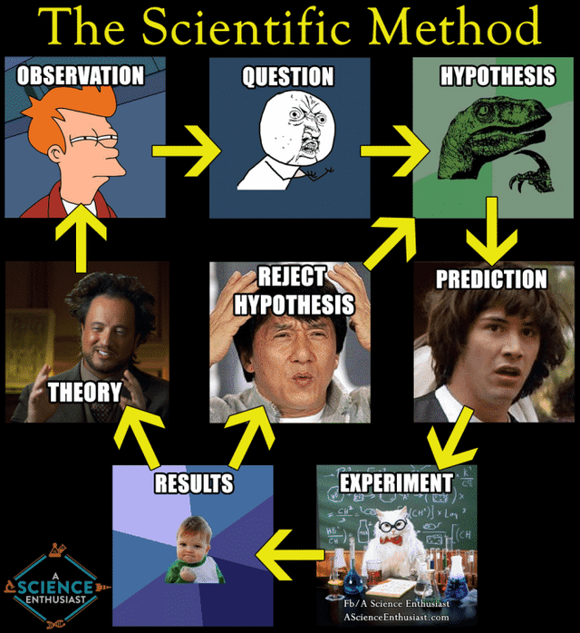

## Today's Agenda {background-image="Images/Background-Rally_v2.png" .center}

```{r}
# background-size="1920px 1080px"
library(tidyverse)
library(readxl)
```

<br>

::: {.r-fit-text}

Gathering and evaluating "facts" about the political world

- (with science!)

:::

<br>

::: r-stack
Justin Leinaweaver (Fall 2024)
:::

::: notes
Prep for Class

1. Review and record participation submissions

:::


## Canvas is the backbone of our class {background-image="Images/Background-Rally_v2.png"  .center}

<br>

```{r, fig.align='center'}
knitr::include_graphics("Images/01_1-Canvas_Homepage.png")
```

::: notes

**Any questions or difficulty using Canvas for this class so far?**

<br>

**Any problems submitting your participation assignment today?**

:::


## The answer is probably in the syllabus  {background-image="Images/Background-Rally_v2.png" .center}

<br>

```{r, fig.align='center'}
knitr::include_graphics("Images/01_1-Course_Syllabus.png")
```

::: notes

**With a couple days to think about it, any questions on the syllabus or the requirements of the class?**

:::


## The Science in Political Science {background-image="Images/Background-Rally_v2.png" .center}

```{r, fig.align='center'}
knitr::include_graphics("Images/02_1-monkey_darts_politics.jpg")
```

::: notes

Big picture aims for today: 

1. We have to acknowledge the tenuous nature of ALL "facts"
    - Our understanding of the world is constantly evolving
    
    - Knowledge never stands still!

2. Whatever method we adopt for learning new things must be adapted to this recognition that knowledge is never permanent

    - Hence, our discipline's embrace of science and the scientific methods!
    
<br>

**Based on the Donovan and Hoover reading, what are the key elements to practicing political science as a "science"?**

- **In other words, how do we make sure we are creating knowledge scientifically?**

<br>

"The point is that the scientific method seeks to test thoughts against observable evidence in a disciplined manner, with each step in the process made explicit" (H&D old p24, new p29?).

- We must clearly identify and define our concepts,

- We must generate and clearly explain our theories and hypotheses,

- We must THEN gather appropriate, high quality evidence

- We must than analyze out hypotheses using data, and

- We must acknowledge the uncertainty in our conclusions


:::


## Let's process some new "facts"!  {background-image="Images/Background-Rally_v2.png" .center}

<br>

```{r, fig.align='center'}

```

::: notes

Here is the assignment you all completed before class today.

- Let's use these facts and evaluations to help us think more critically about the nature of the world and truth

<br>

*Split class into small groups (3-4 per)*

- Go sit with your group!

:::


## 1. Evaluate the Submissions  {background-image="Images/Background-Rally_v3.png" .center}

<br>

:::: {.columns}

::: {.column width="40%"}
```{r, fig.align='center'}

```
:::

::: {.column width="10%"}

:::


::: {.column width="50%"}
### Confidence Level

- High (4)

- Moderate (3)

- Low (2)

- None (1)
:::

::::

::: notes

GROUPS: I want you to review and then classify each submitted fact by your level of confidence: High, Moderate, Low or None

- Make sure to keep a record of your decisions (and points of contention!)

:::


## 2. Rank the Submissions {background-image="Images/Background-Rally_v3.png" .center}

<br>

:::: {.columns}

::: {.column width="60%"}
```{r, fig.align='center'}

```
:::

::: {.column width="30%"}

::: {.r-fit-text}
- Top 5

- Bottom 5

:::

:::

::::

::: notes

With scores in hand now go through and select a top-5 list (facts you are most confident in) and a bottom-5 (least confident in).

- Get ready to present both lists to the class.

:::


## 3. Identify Key Characteristics {background-image="Images/Background-Rally_v3.png" .center}

<br>

### Make Two Lists

1. What specific characteristics boosted your confidence? 

2. What specific characteristics lowered your confidence?


::: notes

With your scores and rankings complete I now want you to step back and generalize from the exercise.

- Make two lists of characteristics for us.

- Focus on the top-5 and describe what they have in common or what they did so well

- Then focus on the bottom-5 and repeat the exercise

- After this we all report back and see where we ended up

:::


## Let's process some new "facts"!  {background-image="Images/Background-Rally_v2.png" .center}

<br>

```{r, fig.align='center'}

```

::: notes

**Ok groups, give us your top-5, your bottom-5 and the key characteristics you relied on for the evaluations**

- *PRESENT and DISCUSS all*

- *NOTES ON BOARD*

:::


## Given the aim of this class is to prepare you to do scientific research on the political world, what are the big takeaways from our work today? {background-image="Images/Background-Rally_v2.png" .center}

::: notes

FIRST, ALL facts are tenuous and knowledge is constantly evolving

- Stop being precious about facts! 
    
- Knowing lots of trivia is not the same thing as being smart given that all facts have a shelf-life

<br>

SECOND, be humble in your knowledge

- Even the person with the most "knowledge" in the world knows almost nothing compared to the sheer amount we don't yet know

- PLUS, as to point one, a time is coming when what you know FOR CERTAIN will probably be wrong!

<br>

SLIDE: FINALLY, we embrace science because it is a method for developing knowledge that is built on this idea of change

:::


## Key Lessons for Doing Research? {background-image="Images/Background-Rally_v2.png" .center}

```{r, fig.align='center'}

```

::: notes

Remember, science is a process for generating knowledge, not a bucket of facts about the natural world.

- Science is never complete, our conclusions are never certain

- Our job is to reduce the uncertainty in the world and we do this by being transparent in our methods and replicatable in our work

- Knowledge that cannot be independently confirmed is not useful.

<br>

Bottom line, you can study anything "scientifically."

- Even politics!

:::


## For Next Class {background-image="Images/background-blue_triangles.jpg" .center}

<br>

The Components of Peer-Reviewed Research

- Readings on the big picture task of writing a research paper and "how to read" journal articles

- *Bring to class for practice:* Fortna, Lotito & Rubin (2018)

::: notes
Questions on anything from today?
:::