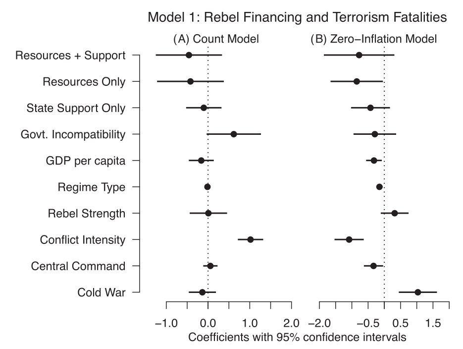

## Today's Agenda {background-image="Images/Background-Rally_v2.png" .center}

```{r}
# background-size="1920px 1080px"
library(tidyverse)
library(readxl)
```

<br>

::: {.r-fit-text}

**The Components of Peer-Reviewed Research**

- Identifying the key components of published research

:::

<br>

<br>

::: r-stack
Justin Leinaweaver (Fall 2024)
:::

::: notes
Prep for Class

1. Readings
    - Baglione Chapter 1
    - Krippner (2000)
    - Hoover Green (2013)
    - Fortna, V. P., Lotito, N. J., & Rubin, M. A. (2018). Don’t Bite the Hand that Feeds: Rebel Funding Sources and the Use of Terrorism in Civil Wars. International Studies Quarterly, 62(4), 782–794. https://doi.org/10.1093/isq/sqy038
    
2. Bring your annotated copy of Fortna article to class
    - Scanned and in Readings folder

3. Any time saved at the end of class you can give to them to work on the assignment for Thursday

<br>

SLIDE: Let's kick off this week connecting our dots again!

:::


## The Political Science Major {background-image="Images/Background-Rally_v2.png"  .center}

<br>

```{r, fig.align='center'}
knitr::include_graphics("Images/01_1-PLSC_Major_Required_Courses3.png")
```

::: notes

As we discussed last week, our major includes a methodology track of three classes designed to prepare you to do cutting-edge, scientific research on the political world

<br>

This class represents your first official step along that track

<br>

SLIDE: What do we mean by scientific research?

:::


## The Science in Political Science {background-image="Images/Background-Rally_v2.png" .center}

```{r, fig.align='center'}
knitr::include_graphics("Images/02_1-monkey_darts_politics.jpg")
```

::: notes

**Per Hoover and Donovan, what do we have to do in order to study the political world "scientifically"?**

- (SLIDE)

:::


## The Science in Political Science {background-image="Images/Background-Rally_v2.png" .center}

<br>

"The point is that the scientific method seeks to test thoughts against observable evidence in a disciplined manner, with each step in the process made explicit" (H&D p30).

- We must clearly identify and define our concepts,

- We must clearly explain our theories and hypotheses,

- We must THEN gather appropriate, high quality evidence

- We must analyze our hypotheses using data, and

- We must acknowledge the uncertainty in our conclusions

::: notes

*Refresh memories by reading the slide*

<br>

**Why is it crucial that we do all of this in order to produce new knowledge?**

- **In other words, what is true about all "facts" according to Arbesman (2012)?**

<br>

All facts, in the aggregate, have a half-life!

- Facts change constantly (e.g. Smoking was once doctor recommended, Earth was once the center of the universe in our models, dinosaurs now have feathers!)

- AND we can measure the amount of time for half of a subject's knowledge to be overturned" (p3).

<br>

So, putting it all together:

1. Our goal is to produce knowledge about the world,

2. The knowledge we produce is uncertain, and

3. "Science" is a method for producing knowledge in a transparent way that is designed to embrace this uncertainty

<br>

**Questions on this?**

<br>

The methodology track in our major will train you to do each of these key steps

- SLIDE: In this class we will focus on the first two

:::


## PLSC 160: Inquiry in Political Science {background-image="Images/Background-Rally_v2.png"  .center}

<br>

::: {.r-fit-text}

Designing a "good" research proposal requires:

- A compelling research question,

- A foundation in the academic literature, and 

- A clear theoretical story to test
:::

::: notes

By the end of the semester, you should be able to produce a research proposal

- e.g. a coherent foundation for performing a scientific research project

<br>

That means being able to clearly communicate to the reader:

1. An important research question, 

2. The state of our knowledge about that question, and

3. Your best argument for why the world behaves as it does

<br>

Starting next week we will dig into each of these challenges in order

- HOWEVER, this week I want us to dive into the deep end a bit and spend some time seeing how the "pros" do it

- Don't stress the fine details yet, but let's review some academic literature to see if we can recognize the key elements of Hoover and Donovan in them.

<br>

SLIDE: Let's discuss the advice I assigned you before we tackle the first research paper

:::


## {background-image="Images/Background-Rally_v2.png"}

::: {.r-fit-text}
**How to Read a (Quantitative) Journal Article (Krippner 2000)**
:::

{.absolute left=150 width="750"}

::: notes

Let's start with the Krippner advice on reading quantitative research

<br>

**What big picture advice does Krippner (2000) offer you to help you read research papers?**

- **Focus primarily on the first four bullet points!**

<br>

SLIDE: My takeaways

:::


## {background-image="Images/Background-Rally_v2.png" .center}

::: {.r-fit-text}
**How to Read a (Quantitative) Journal Article (Krippner 2000)**
:::

::: {.fragment}
1. All research articles follow a formula
    - Intro
    - Theory
    - Data / Methods
    - Analysis
    - Results / Discussion

:::

::: {.incremental}
2. The answers SHOULD BE in the text

3. Practice, practice, practice
:::

::: notes


<br>

REVEAL: FIRST, all good scientific research "articles follow a formula"

- Learning to read research article is like reading a recipe for a new meal

- Each section has a very specific job and you will learn to quickly extract the key piece from each

- **Any questions about what each section typically does (as per Krippner bullet 1)?**

<br>

REVEAL: SECOND, you shouldn't have to be a statistician to read quantitative research!

- ALL the key info in the tables and visualizations SHOULD be described in the text!

- A well written article should explain what they did and what they learned from doing it!

<br>

REVEAL: THIRD, this will get easier with time, practice and more experience learning research design.

- THAT is one of the important purposes of this class

<br>

**Questions on this advice?**

- The rest of the bullet points offer useful advice for dealing with data

- Most of that work will wait until you take 296 Data analysis in the spring

<br>

SLIDE: Let's jump to the advice from Green (2013)

:::


## {background-image="Images/Background-Rally_v2.png" .center}

::: {.r-fit-text}
**How to Read Political Science (Green 2013)**

1. Title, Headings, Abstract	

2. Skim for Signposts

3. Read Strategically

4. Review

:::

::: notes
**Per Green (2013), how should we read a political science article?**

- **What are the key pieces of advice in this essay?**

<br>

I think this is really useful big picture advice

- Scientific research articles are not precious collections of complex metaphors

- They are NOT Shakespeare

- You should not have to agonize over unpacking the author's meaning

<br>

Research articles should diagram the act of doing science

- The arguments should be clearly flagged and explained!

- The methods should be clearly applied and explained!

<br>

If the basic structure of the article doesn't make sense, than that's bad science!

- That's not to say we will always understand the methods; tools are complex

- BUT all of the elements of the recipe should be completely obvious on first read

<br>

SLIDE: Ok, lets combine all this advice and use it to propose an approach to reading research articles

:::


## {background-image="Images/Background-Rally_v2.png" .center}

::: {.r-fit-text}
**How to Read Political Science (amended)**
:::

::: {.incremental}
1. Carefully read the abstract and the introduction

2. Develop an outline of the article (bullets and p#):
    - The research question (why important?)
    
    - The key concepts (any debate?)
    
    - The main argument (key mechanisms?)
    
    - The data (sources and cases?)
    
    - The conclusions (how confident are they?)
    
3. Evaluate: What are the strongest and weakest parts of the paper?
:::

::: notes

I will not pretend this is the only way to do this, but I'd like to talk you through one useful way to read new literature

- This is how I will ask you to explore the literature we read this week (and going forward)

- REVEAL x 8

<br>

So, my advice:

1. Read the abstract and introduction carefully to get a broad idea of the entire paper

2. Skim the rest to summarize these key components

3. Finally, take a moment to reflect on your summary of the paper and use it to evaluate the research
    - Critical analysis!

<br>

**Make sense? Everybody have this written down?**

<br>

**Questions on this approach before we practice using the Fortna Lotito, & Rubin (2018) article?**

:::


## Fortna, Lotito and Rubin (2018) {background-image="Images/Background-Rally_v2.png"}

<br>

```{r, fig.align='center'}
knitr::include_graphics("Images/02_1-Fortna2018-Title.png")
```

::: notes

Split class into small groups (3 per?)

- Sit with your group

<br>

Everybody take some time and read the abstract and the introduction

- Don't get bogged down in note taking, just read to get a sense of the research paper

:::


## Fortna, Lotito and Rubin (2018) {background-image="Images/Background-Rally_v2.png" .center}

<br>

Develop an Outline of the Article (bullets and p#):

- The research question (why important?)
    
- The key concepts (any debate?)
    
- The main argument (key mechanisms?)
    
- The data (sources and case selections?)
    
- The conclusions (how confident are they?)

::: notes

Ok groups, create a shared outline with these five sections

- Each section should get bullet point answers, and 

- Each bullet point needs a page number as reference

- Go!

<br>

*ON BOARD: PRESENT and DISCUSS each section*

:::


## Fortna, Lotito and Rubin (2018) {background-image="Images/Background-Rally_v2.png" .center}

<br>

### Evaluate the Research: What are the strongest and weakest parts of the paper?

::: notes

Alright groups, only after completing this summary work can we move to the critical analysis step

- NOW, reflect on these article summaries to make us two lists

- What are the strengths and weaknesses of the article?

<br>

*ON BOARD: PRESENT and DISCUSS each LIST*

<br>

**Alright, how are we feeling with this exercise?**

- I promise this exercise gets easier and easier with practice

- You will also get faster and faster at this the more you do it!

:::


## For Next Class {background-image="Images/background-blue_triangles.jpg" .center}


::: notes

*IF TIME REMAINS, let them get started on this!*

<br>

For Thursday we will practice everything from today on two new articles.

<br>

You will do the Xu (2021) on your own

- Before class submit your outline and argument analyzing the article as a participation assignment

<br>

Please do this exercise working on your own!

- I need to see where each of you are on this kind of exercise

- Think of this like setting a skills baseline for the semester

<br>

In class we will then practice on a third article so please bring it to class

- Clayton, A., O’Brien, D. Z., & Piscopo, J. M. (2023). Women Grab Back: Exclusion, Policy Threat, and Women’s Political Ambition. *American Political Science Review*, 117(4), 1465–1485.

<br>

**Questions on the assignment?**

:::


