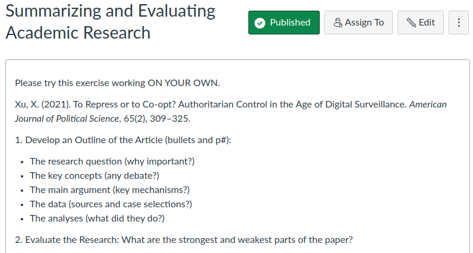

## Today's Agenda {background-image="Images/Background-Rally_v2.png" .center}

```{r}
# background-size="1920px 1080px"
library(tidyverse)
library(readxl)
```

<br>

::: {.r-fit-text}

**The Components of Peer-Reviewed Research**

- Identifying the key components of published research

:::

<br>

<br>

::: r-stack
Justin Leinaweaver (Fall 2024)
:::

::: notes
Prep for Class

1. Review assignments

2. Save 45 minutes to work on the second article in class

3. Readings
    - Xu, X. (2021). To Repress or to Co‐opt? Authoritarian Control in the Age of Digital Surveillance. American Journal of Political Science, 65(2), 309–325.
    
    - Clayton, A., O’Brien, D. Z., & Piscopo, J. M. (2023). Women Grab Back: Exclusion, Policy Threat, and Women’s Political Ambition. American Political Science Review, 117(4), 1465–1485. https://doi.org/10.1017/S0003055422001344

<br>

SLIDE: Assignment for today

:::


## For Today {background-image="Images/Background-Rally_v2.png" .center}



::: notes

*Save 45 minutes for the second article*

<br>

*Split class into small groups (3 per)*

- Groups compare your submitted outlines and arguments; see if you were on the same page or not across the categories

- Get ready to report back and help the class build a single consensus outline on the board

<br>

*ON BOARD*

- Let's build our consensus outline on the board (we'll do the arguments in a moment)

<br>

*ON BOARD*

- Time for our strengths and weaknesses lists!

<br>

**Ok, any questions on the exercise of outlining a research article?**

<br>

SLIDE: Let's practice one more time!
:::


## Clayton, O’Brien and Piscopo. (2023). Women Grab Back: Exclusion, Policy Threat, and Women’s Political Ambition. *APSR*, 117(4), 1465–1485. {background-image="Images/Background-Rally_v2.png" .center}

::: notes

*Create NEW small groups (3 per)*

- Go sit with your group and pull out the new article

<br>

I've tried to give you three articles this week covering a wide range of topics and applying a WIDE range of methods

<br>

For example, this article is what we call qualitative research (meaning analyses that don't require stats or numbers)

- In addition, these authors use both focus groups and surveys with embedded experiments in them

- Those are both very cool ways to do science!

<br>

To start, everybody read the abstract and introduction only.

- Again, don't get bogged down in the details just read to get a sense of the project!

:::


## {background-image="Images/Background-Rally_v2.png" .center}

**I. Summarize: Outline the Article (bullets and p#):**

- The research question (why important?)
    
- The key concepts (any debate?)
    
- The main argument (key mechanisms?)
    
- The data (sources and case selections?)
    
- The conclusions (how confident are they?)

<br>

**II. Evaluate: Strengths and weaknesses lists** 

::: notes

Now, groups, let's summarize and evaluate this article!

- Get ready to report back your summary outlines and analyses!

<br>

Let's start with the summaries!

- *ON BOARD*

<br>

And now we do the evaluations!

- *ON BOARD: Strengths vs Weaknesses*

<br>

**How are we feeling with this exercise?**

- **Can you feel yourself getting even a little more comfortable with it?**

<br>

The funny part is, we haven't yet spent any time unpacking the elements of research design!

- SLIDE: Next week we begin by focusing on research questions
:::


## For Next Class {background-image="Images/background-blue_triangles_flipped.png" .center}

<br>

::: {.r-fit-text}

**Research Questions**

1. Baglione (2019) Chapter 2

2. Huntington-Klein, N. (2022) Chapter 2

3. Submit Canvas assignment 

:::

::: notes

Your job will be to cover the basics outside of class so that we can use what you've learned in class to practice and refine these skills

- **Questions on the assignment?**

<br>

Kind of cool head's up, after we review RQs on Tuesday we will be putting our new knowledge directly to the test

- Next Thursday we will be working with the current Senior Seminar class

- They will give us and explain their proposed RQs and we will give them feedback!

:::