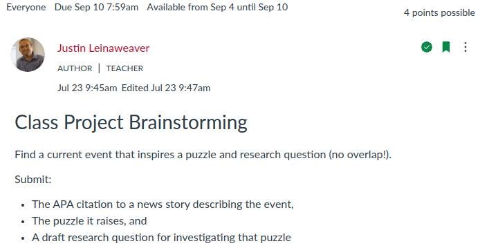
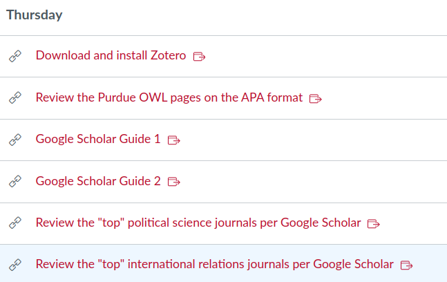

## Today's Agenda {background-image="Images/Background-Rally_v2.png" .center}

```{r}
# background-size="1920px 1080px"
library(tidyverse)
library(readxl)
```

<br>

::: {.r-fit-text}

**Brainstorming a Class Research Project**

- Selecting a research question

- Developing an importance argument

:::

<br>

::: r-stack
Justin Leinaweaver (Fall 2024)
:::

::: notes
Prep for Class

1. Grade Canvas submissions as class presents each

2. Plan timings for today
    - (15) Present each submitted event
    - (45) Brainstorming RQs (alone, pairs, fours)
    - (15) Brainstorming importance (alone, pairs)

<br>


:::


## PLSC 160: Inquiry in Political Science {background-image="Images/Background-Rally_v2.png"  .center}

<br>

::: {.r-fit-text}

Designing a "good" research proposal requires:

- A compelling research question,

- A foundation in the academic literature, and 

- A clear theoretical story to test
:::

::: notes

Our goal in this class is to ensure that each of you develop the skills you need to design "good" research proposals

- Think of a "good" proposal as one with an important topic, that builds on an established academic literature and proposes a compelling theory of political behavior

<br>

Over the next seven weeks we will develop our first high quality research proposal while working together as a group

- This way, on your first effort at this, we are all "pulling" in the same direction and you have 20 other researchers helping you develop the best proposal you can.

<br>

SLIDE: That goal and approach in mind, I asked each of you to help us brainstorm a research question for this proposal

:::


## For Today {background-image="Images/Background-Rally_v2.png" .center}



::: notes

To start, everybody go around the room and tell us:

1. What event did you submit?

2. Why did you pick it?

<br>

*PRESENT and DISCUSS each*

<br>

Ok, let's pick one of these events.

- **What do you want to focus on for our class research project?**

:::


## "Good" Research Questions {background-image="Images/Background-Rally_v2.png" .center}

<br>

### A good question...

- is interesting, important, controversial, brief, direct, doable and puzzling (Baglione 2019)

- considers potential results, feasibility,  scale and design (Huntington-Klein 2022)

::: notes

Ok, we have our event selected

- Now I want everyone to take some time ON THEIR own to brainstorm a "good" research question we could use to explore some aspect of this event

- Don't rush this process, try to focus on this task! (7-8 minutes?)

<br>

PAIRS: Share your brainstormed questions with the person next to you

- Give each other feedback

<br>

FOURS: Share your brainstormed questions, give each other feedback

<br>

CLASS: Ok, give me your best options for the board!

- *ON BOARD*

<br>

**Which question do we want to choose?**

:::


## Why is this topic important? {background-image="Images/Background-Rally_v2.png" .center}

::: notes

Our next job is to build an argument that will convince the reader that we have chosen an important topic.

- Everybody take a few minutes to brainstorm reasons this topic is important

- Don't edit yourself, just make as long a list as you can think of!

<br>

PAIRS: Compare lists, give each other feedback

<br>

*ON BOARD*: Let's gather our options!

<br>

Make sure to save these!

- You'll need them for the first part of your research proposal when you set out to convince the reader of the importance of the topic


:::


## For Next Class {background-image="Images/background-blue_triangles.jpg" .center}

<br>



::: notes

Thursday we pause our project development in order to get our ducks in a proverbial row as regards finding and organizing academic literature

- I'll ask everyone to review these links AND

- Bring a laptop to class that we can use to install and begin working with Zotero (a bibliographic manager)

<br>

**Questions on anything from today or the assignment for Thursday?**

:::