## Today's Agenda {background-image="Images/Background-Rally_v2.png" .center}

```{r}
# background-size="1920px 1080px"
library(tidyverse)
library(readxl)
```

<br>

::: {.r-fit-text}

**Setting Up a Class Research Project**

- Finding, organizing and citing academic literature

:::

<br>

::: r-stack
Justin Leinaweaver (Fall 2024)
:::

::: notes
Prep for Class

1. Bring work PC to class so you can do all the steps today live

2. Readings
    - Download and install [Zotero](https://www.zotero.org/)
    - Review the [Purdue OWL pages on the APA format](https://owl.purdue.edu/owl/research_and_citation/apa_style/apa_formatting_and_style_guide/general_format.html)
    - [Google Scholar Guide 1](https://paperpile.com/g/google-scholar-guide/)
    - [Google Scholar Guide 2](https://blog.google/products/search/tips-google-scholar-expert/)
    - Review the ["top" political science journals per Google Scholar](https://scholar.google.com/citations?view_op=top_venues&hl=en&vq=soc_politicalscience)
    - Review the ["top" international relations journals per Google Scholar](https://scholar.google.com/citations?view_op=top_venues&hl=en&vq=soc_diplomacyinternationalrelations)

<br>

Today we need to get a few digital tools and search methods down so we can make progress on our class research project

- I'll make sure to do all of the steps with you on this laptop

:::


## {background-image="Images/Background-Rally_v2.png" .center}

::: {.r-fit-text}
**Install Zotero AND a browser connector**
:::

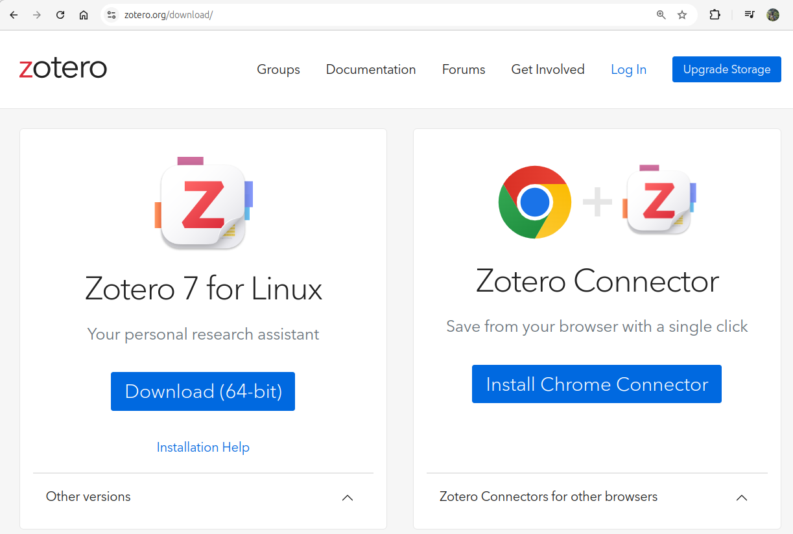{style="display: block; margin: 0 auto"}

::: notes

FIRST things first, I want everyone to download and install BOTH Zotero and the browser connector

:::


## Add items with ISBN or DOI {background-image="Images/Background-Rally_v2.png" .center}

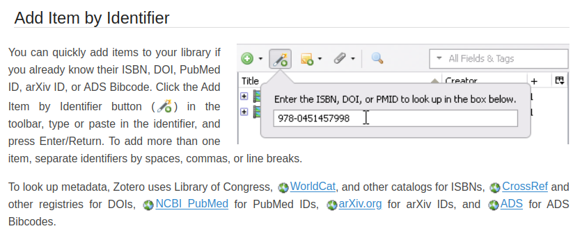{style="display: block; margin: 0 auto"}

<br>

:::: {.fragment}

::: {.r-fit-text}

**Add Dr. Ponder's book: ISBN 978-1-5036-0406-3**

:::

::::

::: notes

Super easy to enter new references for any source with an identifying number:

- Books should have an ISBN number

- Articles should have a DOI number

:::


## Auditing the Results... {background-image="Images/Background-Rally_v2.png" .center}

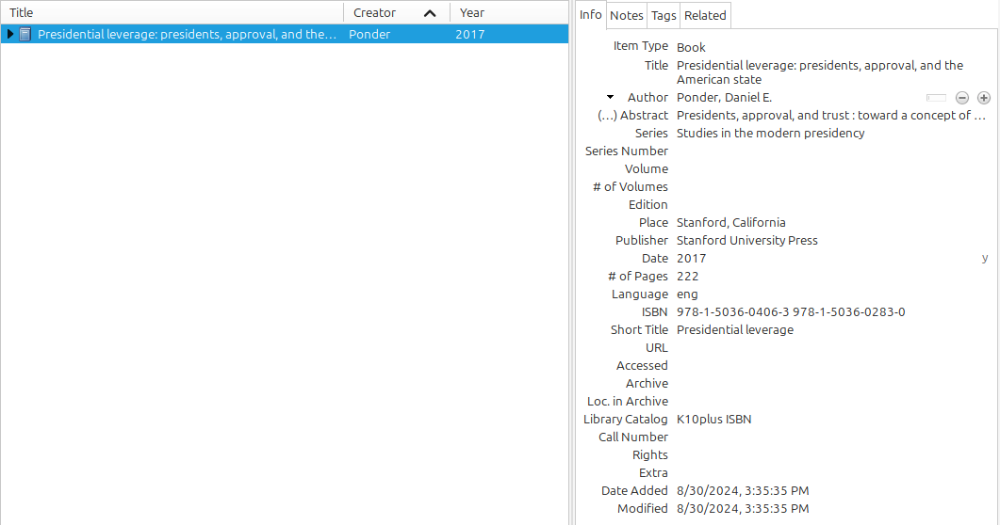{style="display: block; margin: 0 auto"}

::: {.r-fit-text}

**...means knowing what fields are important in APA**

:::

::: notes

Review the results (make sure the import included all key pieces and formatting is correct)

- Does this include all the details we need to produce an APA citation?

- Is all the information in the right places?

<br>

SLIDE: Now click the "notes" tab on the right window...

:::


## APA Citations: General Advice {background-image="Images/Background-Rally_v2.png" .center .smaller}

**Books**

Author, A. A. (Year of publication). *Title of work: Capital letter also for subtitle*. Publisher Name. DOI (if available)

<br>

**Articles**

Author, A. A., Author, B. B., & Author, C. C. (Year). Title of article. *Title of Periodical, volume number*(issue number), pages. https://doi.org/xx.xxx/yyyy

<br>

**Web Pages**

Lastname, F. M. (Year, Month Date). *Title of page*. Site name. URL

::: notes

The basic requirements for an APA citation

- Keep these in mind as you audit the records you import into Zotero

- These are the fields to make sure are clear, in the right spot and formatted correctly

<br>

**Questions on these?**

<br>

Now everyone check the Ponder book entries.

:::


## Add Notes... {background-image="Images/Background-Rally_v2.png" .center}

{style="display: block; margin: 0 auto"}

<br>

### **Dr. Ponder's theory of presidential influence depends on a concept called "leverage"**


## Add Citation Styles {background-image="Images/Background-Rally_v2.png" .center}

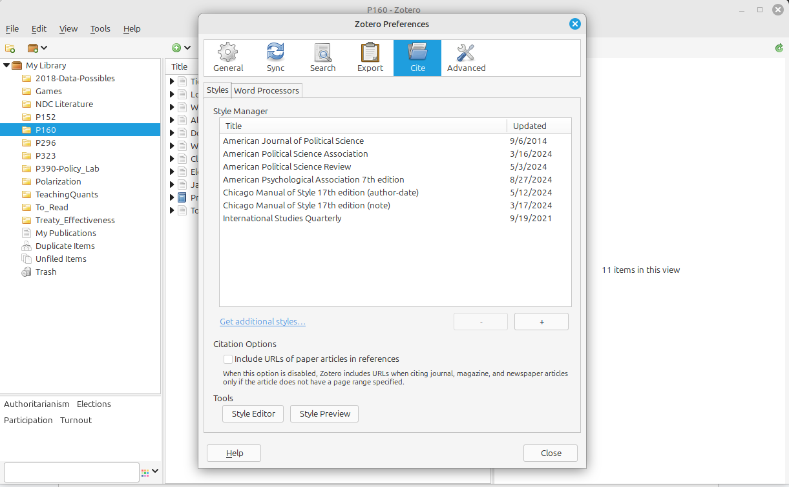{style="display: block; margin: 0 auto"}

::: {.r-fit-text}

**Menu: "Edit" -> "Preferences" -> "Cite"**

:::

::: notes

"You can install styles from the Zotero Style Repository by clicking on the “Get additional styles…” option in the Zotero Style Manager (in the Cite pane of Zotero preferences). Search for the style you want and click the style title to install it into Zotero. You can also visit the Zotero Style Repository webpage in Firefox or Chrome with the Zotero Connector plugin installed to install styles directly into Zotero."

:::


## Create a bibliography entry {background-image="Images/Background-Rally_v2.png" .center}

<br>

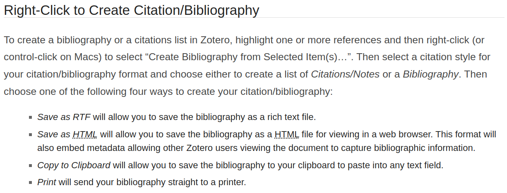{style="display: block; margin: 0 auto"}


## Use the DOI to add an item {background-image="Images/Background-Rally_v2.png" .center}

{style="display: block; margin: 0 auto"}

<br>

Harknett, R. J. & VanDenBerg, J. A. (1997) Alignment theory and interrelated threats: Jordan and the Persian Gulf crisis, Security Studies, 6:3, 112-153


## Add items with the browser connector {background-image="Images/Background-Rally_v2.png" .center}

<br>

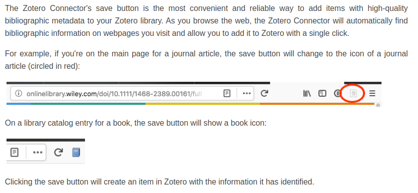{style="display: block; margin: 0 auto"}


## {background-image="Images/Background-Rally_v2.png" .center}

::: {.r-fit-text}
**Use the browser connector to add an item**
:::

{style="display: block; margin: 0 auto"}

<br>

Leinaweaver, J., & Thomson, R. (2021). The Elusive Governance of Climate Change: Nationally Determined Contributions as Commitments and Negotiating Positions. Global Environmental Politics, 21(2), 1–26.


## {background-image="Images/Background-Rally_v2.png" .center}

{style="display: block; margin: 0 auto"}

<br>

Create a bibliography with all three entries

- Leinaweaver and Thomson (2021)
- Ponder (2017)
- Harknett and VanDenBerg (1997)


## Finding High Quality Literature {background-image="Images/Background-Rally_v2.png" .center}

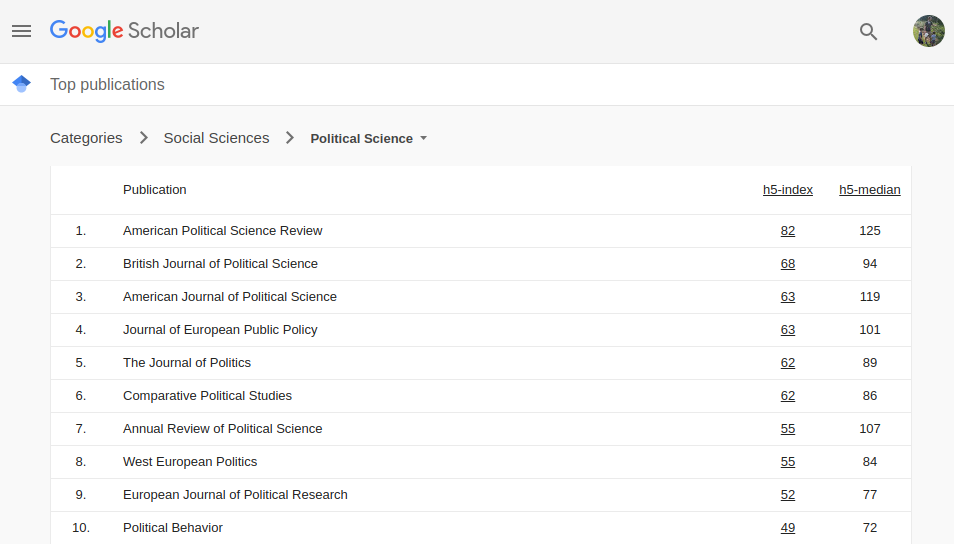{style="display: block; margin: 0 auto"}

::: {.r-fit-text}
**Check the top journal rankings**
:::

::: notes

I gave you links to the top 20 in political science and international relations

<br>

"More" doesn't automatically equal better, BUT more eyes on the research typically means a more important topic and a better chance that mistakes get caught!

<br>

You don't have to stay exclusively with these, BUT

- You MUST focus exclusively on peer-reviewed political science literature!

:::


## Finding High Quality Literature {background-image="Images/Background-Rally_v2.png" .center}

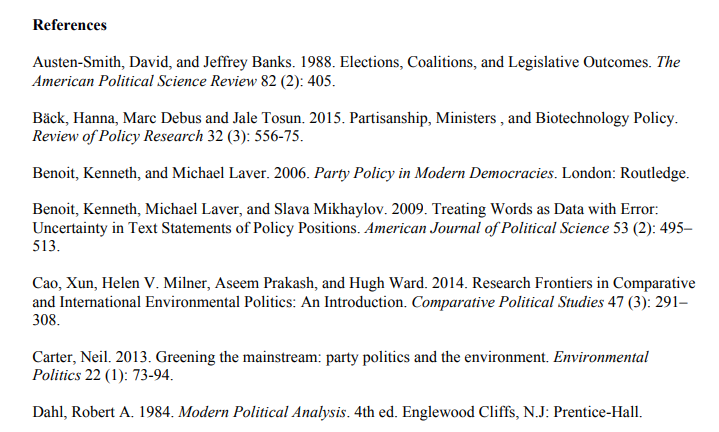{style="display: block; margin: 0 auto"}

::: {.r-fit-text}
**Check the bibliographies of relevant research**
:::

::: notes

Find a useful article on your topic?

- Check their bibliography!

- That is a curated list of all the most relevant literature they believe you should know!

:::


## Finding High Quality Literature {background-image="Images/Background-Rally_v2.png" .center}

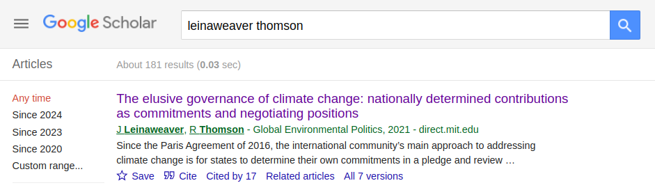{style="display: block; margin: 0 auto"}

<br>

::: {.r-fit-text}
**Check the "Cited by" and "Related" results on Scholar**
:::


## Finding the PDF's {background-image="Images/Background-Rally_v2.png" .center}

<br>

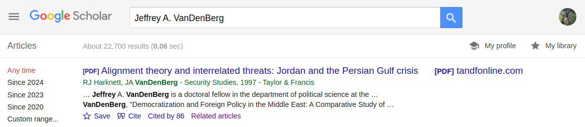{style="display: block; margin: 0 auto"}

<br>

::: {.r-fit-text}
**Best case scenario is Google Scholar**
:::


## Finding the PDF's {background-image="Images/Background-Rally_v2.png" .center}

{style="display: block; margin: 0 auto"}

<br>

::: {.r-fit-text}
**Try "OneSearch" on the library website**
:::


## Finding Journals {background-image="Images/Background-Rally_v2.png" .center}

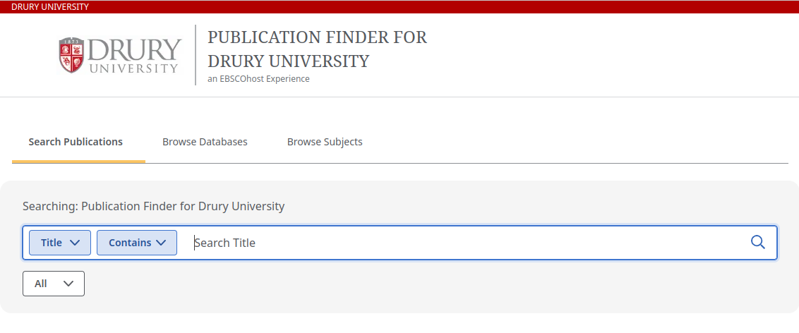{style="display: block; margin: 0 auto"}

<br>

::: {.r-fit-text}
**Library: "Resources" -> "Publication Finder"**
:::


## For Next Class {background-image="Images/background-blue_triangles_flipped.png" .center}

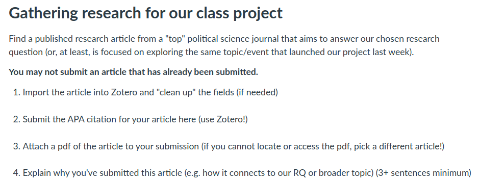

<br>

### What explains the variation in the use of violence by religious groups around the world?

::: notes

**Questions on the assignment?**

<br>

Let's get to work on this now so we you can help each other!

:::