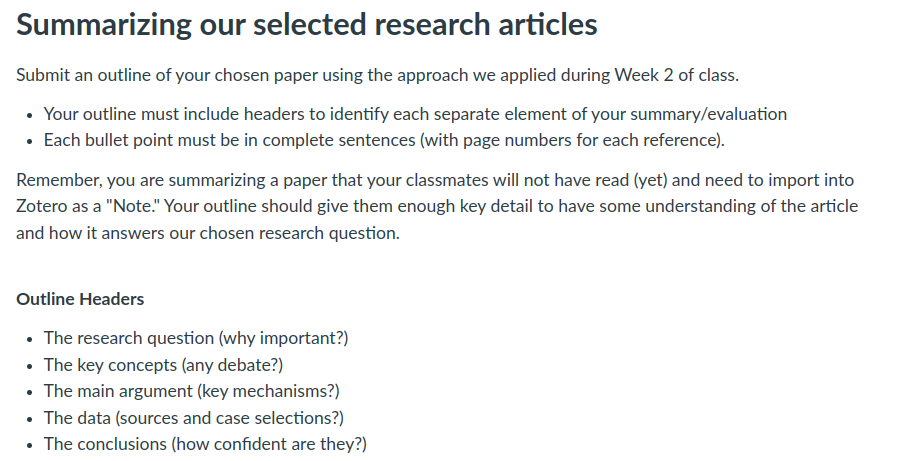
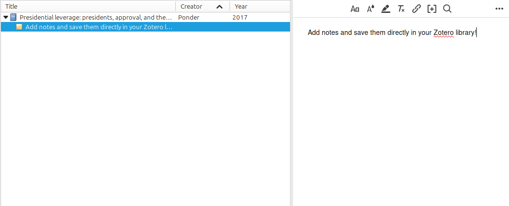

## Today's Agenda {background-image="Images/Background-Rally_v2.png" .center}

```{r}
# background-size="1920px 1080px"
library(tidyverse)
library(readxl)
```

<br>

::: {.r-fit-text}

**Setting Up a Class Research Project**

- Developing our annotated bibliography

:::

<br>

::: r-stack
Justin Leinaweaver (Fall 2024)
:::

::: notes
Prep for Class

1. TBD

<br>


:::


## For Today {background-image="Images/Background-Rally_v2.png" .center}



::: notes

**How did this go?**

- **Getting any easier with practice?**

:::


## Baglione (2019) Chapter 3 {background-image="Images/Background-Rally_v2.png" .center}

<br>

### What is a bibliography and why is it important?

::: notes

(p50-53)

- A treasure map!

- A list of sources that "provides all the information that contributed to the work"

- The list helps to "legitimize" your work by showing: 1) you are connected to other high quality work, and 2) You are aware of the big debates about your topic

:::


## Baglione (2019) Chapter 3 {background-image="Images/Background-Rally_v2.png" .center}

<br>

### What do we have to cite and why is paraphrasing better than quoting?

::: notes

(p53-58)

- Plagiarism is passing off someone's ideas or words as your own

- You MUST cite ideas and information, not just quotations.

- Paraphrasing: "...restating in their own wordsthe sense of others' arguments and citing the original sources" (54).
    - Keep the argument in YOUR words, YOUR voice
    
    - Look at any high quality published research article and you will see almost only paraphrasing, not quoting!
    
<br>

**Questions on these very important topics?**

:::


## Baglione (2019) Chapter 3 {background-image="Images/Background-Rally_v2.png" .center}

<br>

### What is an annotated bibliography (AB)?

::: notes

**Per Baglione, what is the AB?**

- **Put differently, what should the "annotation" do in this context?**

:::


## Building our Class AB {background-image="Images/Background-Rally_v2.png" .center}

<br>

The annotation is "a paragraph or more that contains a summary of the *arguments of the work as they relate to your Research Question*, as well as key information about the topics the author discussed in making the argument and the research findings" (Baglione 2020, 59).

::: notes

(p59-88)

- Adds an "annotation" to each entry in your bibliography

- The annotation is "a paragraph or more that contains a summary of the *arguments of the work as they relate to your Research Question*, as well as key information about the topics the author discussed in making the argument and the research findings" (59).

- Adopt the form: "The author argues/asserts/contends/insists" but never "This work is about..."

<br>

**How is this activity different from the summary exercise you did for class today?**

- Our outlining exercise so far this semester has been about summarizing the basic elements of a research paper

- Your AB is written in paragraph form (not bullet points) and summarizes the argument AS IT PERTAINS TO ANSWERING YOUR RESEARCH QUESTION

- If I wanted to answer my question but all I had was this article, what would I say is the extent of our knowledge?

- What are the valuable "bits" in this article a researcher should consider if working in this area? 
    
    - e.g. useful data, sources, cases, theories 

<br>

**Does this make sense?**

- **Did the examples in the chapter help?**

<br>

I know Baglione also argues that an AB should be organized and grouped by ideas or answers to your RQ, but I think we'll hit those points in our work next week

- **Any questions before we practice this?**

:::


## Building our Class AB {background-image="Images/Background-Rally_v2.png" .center}

<br>

The annotation is "a paragraph or more that contains a summary of the *arguments of the work as they relate to your Research Question*, as well as key information about the topics the author discussed in making the argument and the research findings" (Baglione 2020, 59).

<br>

**RQ: What explains the variation in the use of violence by religious groups around the world?**

::: notes

Let's practice!

- Everybody take some time to write an AB version of the article outline they submitted to Canvas today

- In a few minutes I'll have you get feedback on these in pairs

<br>

Share your annotation with the person next to you

- Does it clearly summarize the main arguments and contribution of this article to answering our RQ?

<br>

Once you're happy with these let's submit them!

- Everybody add their annotation as a "reply" to their Canvas discussion post for today

:::


## Building our Class AB {background-image="Images/Background-Rally_v2.png" .center}

<br>

{style="display: block; margin: 0 auto"}

::: notes

Let's go through all the submissions today

- As we go you should each copy the outline and annotation into the notes attached to each of the articles in your Zotero library

<br>

*PRESENT each annotation*

- **FOR EACH: Any questions or need for clarification?**

:::


## For Next Class {background-image="Images/background-blue_triangles_flipped.png" .center}

<br>

1. Baglione ch 4

2. Koubi, V. (2019). Climate Change and Conflict. *Annual Review of Political Science*, 22(1), 343–360.

::: notes

For next class, read Baglione and the Koubi (2019) which is an example of a well organized literature review

<br>

**Questions on the assignment?**
:::