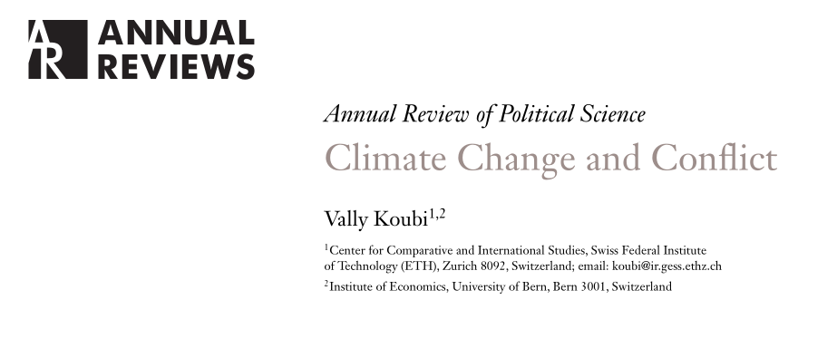
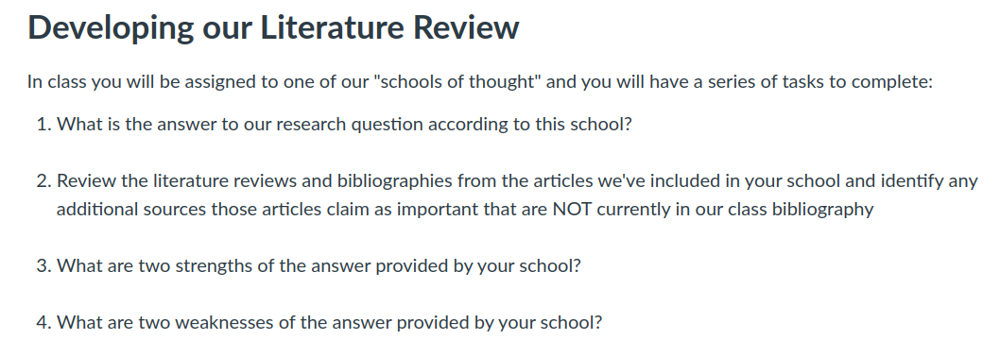

## Today's Agenda {background-image="Images/Background-Rally_v2.png" .center}

```{r}
# background-size="1920px 1080px"
library(tidyverse)
library(readxl)
```

<br>

::: {.r-fit-text}

**Setting Up a Class Research Project**

- Introduction to writing a literature review

:::

<br>

<br>

::: r-stack
Justin Leinaweaver (Fall 2024)
:::

::: notes
Prep for Class

1. Readings
    - Baglione chapter 4
    - Koubi, V. (2019). Climate Change and Conflict. Annual Review of Political Science, 22(1), 343–360. https://doi.org/10.1146/annurev-polisci-050317-070830

<br>

This week we continue our work developing a class research proposal.

<br>

Two weeks ago we developed and refined a research question we wanted to answer

<br>

Last week we:

- Gathered academic literature that aims to answer that research question

- Summarized and analyzed that literature using our outline approach

- Then converted those summaries into annotations

- If you put your annotations together with your list of references you have produced an annotated bibliography.

<br>

This week we work to transform that AB into a literature review.

- SLIDE: Let's make sure we're all on the same page with this next step in the process

:::


## Baglione (2019) Chapter 4 {background-image="Images/Background-Rally_v2.png" .center}

<br>

### What is a literature review and why is it important?

::: notes

**Per the Baglione chapter, what is a literature review and why is it important in a research project?**

<br>

Fundamentally, the literature review is how you connect your proposed project to the cutting-edge of our knowledge

- Making a convincing argument that you are proposing a useful project depends on showing how you will build on what has come before you

- The LR lays out the state of our knowledge on your question and, importantly, where our knowledge is most uncertain

<br>

Per Baglione: 

- "Taking the work of the AB a step further, the LR is a coherent essay that identifies, explains, names, and assesses the answers to your research question in an interesting way" (90).

- The LR "explains to the reader how scholars have answered your Research Question (RQ), in both its generic and specific forms" (90). 

- "In addition, ... the LR assesses the strengths and weaknesses of each school, examining the quality of the logic and how well each approach accounts for cases other than the ones being addressed directly in the paper" (90).

<br>

**Any questions on the big picture of the LR?**

:::


## Baglione (2019) Chapter 4 {background-image="Images/Background-Rally_v2.png" .center}

<br>

### What are "schools of thought" and why do we need them?

::: notes

**Per Baglione, what are the "schools of thought" and why do we need them?**

<br>

Unlike your AB, the LR is a component of your research proposal and that means it must be written in essay form

- That means written as paragraphs with clear topic sentences that advance your central ideas

<br>

The question then becomes, what "central ideas"?

- THAT is the first key step of converting your AB into a literature review

- Your job is to organize all of the answers to your RQ in your AB into groups

- These "groups" or "schools of thought" represent "replies that share common elements"

<br>

In other words, your job is to take all of this research and organize it so:

1. A reader can rapidly understand the state of our knowledge on your question, and

2. You know the meso structure that will be needed by your LR essay
    - e.g. the order and key points that must be made in the body of your paper

<br>

**Any questions on what we mean by "schools of thought"?**

- SLIDE: Generating them

:::


## Baglione (2019) Chapter 4 {background-image="Images/Background-Rally_v2.png" .center}

<br>

### How do we generate "schools of thought"?

::: {.incremental}

- Chronological order

- Least to most preferred

- By theoretical mechanism

- By data source(s)

- By case

:::

::: notes

**Per Baglione, how do we generate "schools of thought"?**

- REVEAL: Use chronological order to show the historical development of an area of inquiry

- REVEAL: Cycle through schools from least to most preferred

<br>

I like the chronological one as that makes sense to me, but I don't love the second option here

- If you do a "least to most" approach badly you are likely to confuse the reader and offend the researchers you are discussing

- Remember, Baglione makes the very important point that you must ALWAYS introduce each school in its most favorable light! 
    - Think like a member of that school.

<br>

Some other options worth considering:

REVEAL (not from reading): Groupings based on key mechanism

- Explaining voting: Ideology vs Policy vs Retrospective assessment
    
- Explaining adopting international law: How costly is it vs how serious is the problem vs are your allies joining it

<br>

REVEAL (not from reading): Groupings based on data source used

- Measuring democracy: Polity vs FH vs V-Dem vs Democracy and Dictatorship database

- Measuring Terrorism: GTD vs RAND worldwide database on terrorism

<br>

REVEAL (not from reading): Groupings based on cases studied

- Research focused on one country vs one region vs the world

<br>

**Any questions on generating schools of thought?**

- Key here is to know that you can do this in whatever way makes sense to you, not just these I've listed

- The goal is to coherently organize the existing answers to your question

:::


## Baglione (2019) Chapter 4 {background-image="Images/Background-Rally_v2.png" .center}

<br>

### What is the structure of a literature review section?

<br>

::: {.fragment}

The Fundamentals of the Literature Review

1. What are the relevant schools?
2. How does each answer the question?
3. Strengths and weaknesses of each school?
4. Which is "best" for your project?

:::

::: notes

**Per Baglione, how should we structure the LR section in our papers?**

<br>

(REVEAL)

The Fundamentals of the Literature Review: LR is a "coherent essay" that answers these four questions:

1. What is the literature on your main concept or what are the different schools of thought that have developed in response to your RQ, in both its general and its specific (if possible) forms? Who are the most important authors identified with each school, and how have they influenced the scholarship?

2. How would each school answer your question?

3. What are the strengths and weaknesses of the answers of each school?

4. Which school's argument is the best for your purposes and why, or which school would you like to continue to pursue and why?

<br>

The exact order or structure of the LR is up to you so long as it makes sense in the order you choose

- I tend to prefer LRs that introduce, summarize AND evaluate each school in order

- That way the evaluations (e.g. the weaknesses of that school) can lead directly to the next one

<br>

Per Baglione though, keep in mind:

1. The LR needs an informative title. 
    - Don't just describe the contents. It should communicate the object and purpose of the LR.

2. The LR needs an introduction to summarize the plan for the entire section (p95)
    - I'll be honest, I think the intro paragraphs Baglione argues for are way too long, but that's a matter of taste

3. The LR needs a body of the essay organized clearly around schools of thought

<br>

**Any questions on the LR material covered in the Baglione reading?**

:::


## {background-image="Images/Background-Rally_v2.png" .center}



::: {.fragment}

1. What are the "schools of thought"?

2. What are the strengths and weaknesses of this approach?

:::

::: notes

Let's examine a research article in order to see a LR in action

- I don't mean to pretend this is the world's greatest example, but I think the topic is interesting, the article is short and is a fairly easy read.

<br>

**What is the research question in this article?**

- (RQ: Does climate change increase the likelihood of conflict?)

<br>

REVEAL

- GROUPS (small): Review the "schools of thought" in this article and get ready to report back:

1. What are the "schools of thought"?

2. What are the strengths and weaknesses of this approach?

<br>

**What are the "schools of thought" in this article?**

- **In other words, how is it organized?**

- (Indirect vs direct pathways)

<br>

**What are the strengths and weaknesses of this approach to organizing the literature review?**

<br>

*OPTIONAL*: **Let's take a few minutes to try brainstorming an alternative approach to organizing this literature**

:::


## {background-image="Images/Background-Rally_v2.png" .center}

<br>

### What explains the variation in the use of violence by religious groups around the world?

::: notes

Let's shift our focus back to our class research project

- *Mix up the groups! (3 each)*

- Go sit with your group

<br>

GROUPS, take some time to review the articles on our class bibliography

- Brainstorm options we could use to organize these research articles

- In other words, let's come up with different possible "schools of thought" for our research project

<br>

*PRESENT and DISCUSS options*

- Let's decide on our preferred option!

<br>

SLIDE: *Give them time to start the assignment in class*

:::


## For Next Class {background-image="Images/background-blue_triangles_flipped.png" .center}

<br>



::: notes

*Assign students to the various schools*

<br>

**Questions on the assignment?**

:::