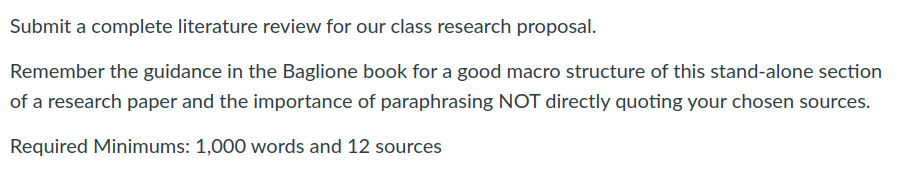

## Today's Agenda {background-image="Images/Background-Rally_v2.png" .center}

```{r}
# background-size="1920px 1080px"
library(tidyverse)
library(readxl)
```

<br>

::: {.r-fit-text}

**Setting Up a Class Research Project**

- Writing our literature review

:::

<br>

::: r-stack
Justin Leinaweaver (Fall 2024)
:::

::: notes
Prep for Class

1. Review Canvas submissions

2. Bring markers to class for all groups (per "school of thought")

3. Prep discussion board on Canvas for collecting in class work (citations, pdfs and annotations)

4. Timing for in class exercises
    - Reporting back assignment on board (30 mins)
    - Gathering new sources (10 mins)
    - Annotating the sources (20 mins)
    - Sharing the annotations (15 mins)

<br>

*As students come in have them sit with their groups!*

<br>

SLIDE: Let's start by talking big picture about literature reviews

:::


## Baglione (2019) Chapter 4 {background-image="Images/Background-Rally_v2.png" .center}

<br>

### Your research proposal MUST have a literature review

<br>

::: {.fragment}

The Fundamentals of the Literature Review

1. What are the relevant schools?
2. How does each answer the question?
3. Strengths and weaknesses of each school?
4. Which is "best" for your project?

:::

::: notes

Refresh my memory!

<br>

**What is a literature review?**

- ("Taking the work of the AB a step further, the LR is a coherent essay that identifies, explains, names, and assesses the answers to your research question in an interesting way" (90).)

**Why is a LR important?**

- (Fundamentally, the literature review is how you connect your proposed project to the cutting-edge of our knowledge)

**What are "schools of thought" and why do we need them?**

- (These "groups" or "schools of thought" represent "replies that share common elements")
- (They organize the structure and logic of your LR)

**How do we generate "schools of thought"?**

- (Chronological order, Least to most preferred, By theoretical mechanism, By data source(s), By case)

**What is the structure of a literature review section?** 

- (REVEAL)

<br>

**Any questions on the LR material from last class?**

:::


## What explains the variation in the use of violence by religious groups around the world? {background-image="Images/Background-Rally_v2.png" .center}

<br>

Post your group's work on the board:

1. What is your school's answer to our RQ?

2. Identify three articles we are missing from our bibliography

3. List strengths of your school

4. List weaknesses of your school

::: notes

*30 minutes*

<br>

GROUPS (by school): Get ready to present your analysis of your assigned school to the class. 

- **Any questions on what I'm asking you to do?**

- Let's go!

<br>

*PRESENT and DISCUSS each*

- Everybody take notes! You need this information for your proposal!

:::


## What explains the variation in the use of violence by religious groups around the world? {background-image="Images/Background-Rally_v2.png" .center}

<br>

::: {.r-fit-text}

Gather the articles missing from our bibliography

1. Import into Zotero, and

2. Find the pdf

3. Share the APA citation and pdf on our discussion board

:::

::: notes

*10 minutes*

<br>

*Divy out the new articles we need to find to pairs of students*

<br>

PAIRS: Go find this article and its pdf and upload to our discussion board

1. Import them into Zotero, and 

2. Find the pdf

3. Share the APA citation and pdf on our discussion board

:::


## What explains the variation in the use of violence by religious groups around the world? {background-image="Images/Background-Rally_v2.png" .center}

<br>

::: {.r-fit-text}

1. Annotate your assigned article, 

2. Clear it with me, AND THEN

2. Share on our discussion board

:::

::: notes

*30 minutes*

<br>

PAIRS: Take some time to review your assigned article and to write an annotation of it to share with the rest of the class.

- Remember the annotation is "a paragraph or more that contains a summary of the *arguments of the work as they relate to your Research Question*, as well as key information about the topics the author discussed in making the argument and the research findings" (59).

<br>

**Questions?**

- Before you submit you have to get my sign-off on it!

- Get to it!

<br>

*PRESENT and DISCUSS each*

:::


## Literature Review (due October 4th) {background-image="Images/background-blue_triangles_flipped.png" .center}

<br>



::: notes

**Questions on the assignment?**

<br>

SLIDE: While that happens in the background, we move forward!

:::


## For Next Class {background-image="Images/background-blue_triangles_flipped.png" .center}

<br>

::: {.r-fit-text}

1. Baglione ch 5 on developing a theory

2. Bring the research articles from Week 2 to class

:::

::: notes

Next week we discuss the final component of your research proposals: Theories, Models and Hypotheses

- Tuesday we'll hit the basics

- Thursday we'll give the Senior Seminar kids our feedback!

<br>

**Questions on the assignment?**

:::