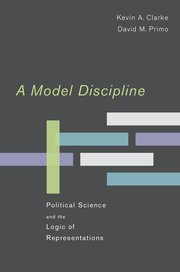
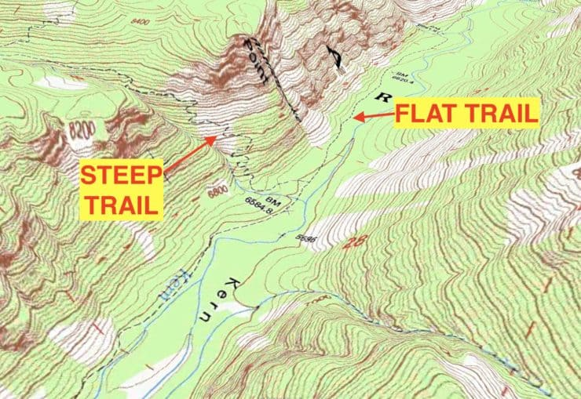
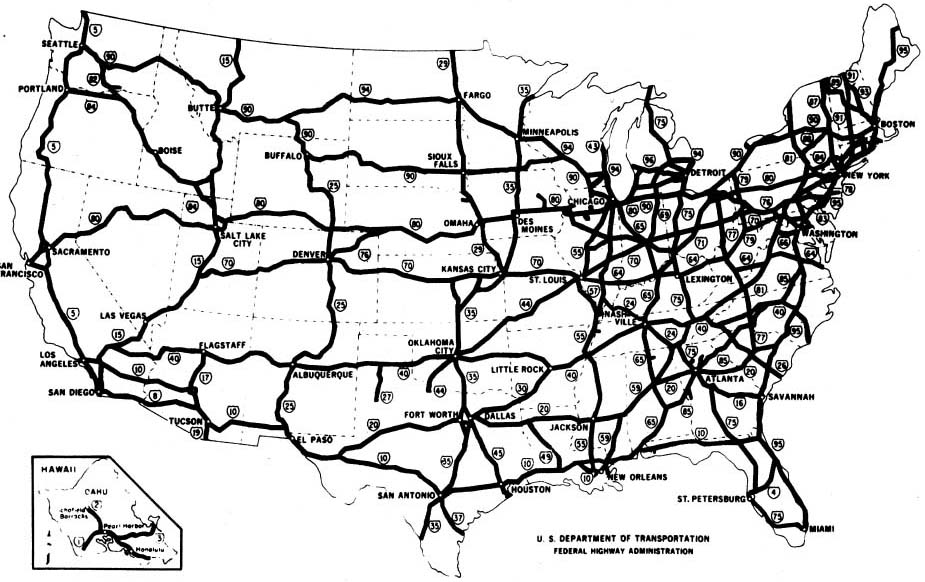
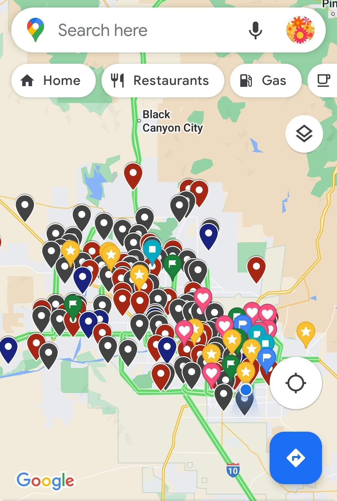
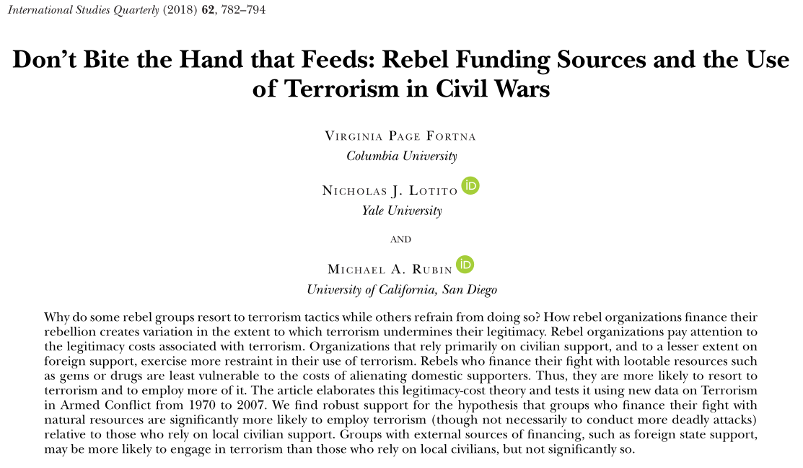

## Today's Agenda {background-image="Images/Background-Rally_v2.png" .center}

```{r}
# background-size="1920px 1080px"
library(tidyverse)
library(readxl)
```

<br>

::: {.r-fit-text}

**Setting Up a Class Research Project**

- Introduction to theories, models and hypotheses

:::

<br>

<br>

::: r-stack
Justin Leinaweaver (Fall 2024)
:::

::: notes
Prep for Class

1. Readings
    - Baglione chapter 5
    
2. Bring markers for multiple small groups to work on the board
    
<br>

SLIDE: This week we continue our work developing a class research proposal.

:::


## PLSC 160: Inquiry in Political Science {background-image="Images/Background-Rally_v2.png"  .center}

<br>

::: {.r-fit-text}

Designing a "good" research proposal requires:

- A compelling research question,

- A foundation in the academic literature, and 

- A clear theoretical story to test
:::

::: notes

Progress so far:

- Three weeks ago we developed and refined a research question we wanted to answer

- Two weeks ago we gathered and annotated academic literature that answers our RQ

- Last week we worked to transform our AB into a literature review so we can communicate the state of our knowledge to other people

<br>

This week we introduce the final component of our research proposal, theories and hypotheses

- SLIDE: In short, the theoretical story represents your proposed answer to our RQ

:::


## Baglione (2019) Chapter 5 {background-image="Images/Background-Rally_v2.png" .center}

<br>

::: {.r-fit-text}

**Defining Terms**

- What is a model? (p114-117)

- What is a hypothesis? (117-120)

:::

::: notes

You will not be surprised to discover that these are contested concepts!

- So, let's start with the Baglione book

<br>

**Per Baglione, what is a model?**

- "...a model is the pictorial representation of your argument or thesis, reduced to its bare bones" (116).

<br>

**Per Baglione, what is a hypothesis?**

- A "particular type of thesis ...  that asserts that a specific cause (or causes) either is correlated with or leads to certain effects" (117).

- Typically phrased in either a positive (increase in x, increase in y), or negative (increase in x, decrease in y) direction

<br>

SLIDE: I'm going to be honest, I don't love these definitions so let's considers some alternatives

:::


## {background-image="Images/Background-Rally_v2.png" .center}

::: {.r-fit-text}
**Competing Definitions of "Theory" or "Model"**
:::

<br>

**Donovan and Hoover (2014)**

+ "...a set of related propositions that suggest why events occur in the manner that they do" (32).

::: {.fragment}

**Mingst and Arreguin-Toft (2017)**

+ "A theory is a set of propositions and concepts that combine to explain phenomena by specifying the relationships among the propositions. Theory's ultimate goal is to predict phenomena" (72).

:::

::: notes

Here's the definition from the reading I assign in my intro IR classes

- I like that this puts the focus of "theory" on explaining why events happen

- Baglione's definitions imply the hypothesis is what gives directionality to the theory

- This makes clear that the theory itself explains the expected relationships, separate from the hypothesis

- **Make sense?**

<br>

REVEAL: The Mingst and Arreguin-Toft (2017) agrees quite closely with Donovan and Hoover but adds an extra piece

- *Read definition*

- "Ultimate goal" is too strong, but I like the acknowledgement that we use theories to help us navigate in new places

- If your theory makes bad predictions, then it isn't a useful theory

- **Make sense?**

<br>

SLIDE: Let's try one more way to think about theories and models also pulling from our discussions in IR

:::


## {background-image="Images/07_1-maps.jpg"}

{.absolute left=0 width=400}

::: notes

In 2012, Primo and Clark wrote an EXCELLENT book titled "A Model Discipline"

- This book is all about the use of models in the social sciences

- It really challenges many of our preconceptions about what models are and what they can be used to do

<br>

I won't take us too deep into their analyses, but I do love the central analogy in the book

- Scientific models are like maps

- When you hear "theory" or "model" they want you to think of a map

- I really try to hammer this perspective home in Intro to IR

<br>

SLIDE: Map examples

:::


## {background-image="Images/Background-Rally_v2.png"}

{.absolute left=0 top=0 width=600}

{.absolute bottom=0 right=0 width=600}

::: notes

Here we have two maps of the United States

<br>

The map on the left is a topographical map
    
- When the lines are tight together it means steep incline
    
- When the lines are spread out it means a gradual change in elevation

- This map makes planning a hike MUCH easier!

<br>
    
The map on the right is a highway map

- Shows the main branches of the federal interstate system

- This map makes navigating across the US by car easier

<br>

**Could we make a single map that accomplishes both tasks?**

- Not easily!

- Any highway map that zooms in enough to show topography is not going to be a simple tool for cross country drives

<br>

SLIDE: Map with too much stuff

:::


## {background-image="Images/Background-Rally_v2.png"}

{style="display: block; margin: 0 auto"}

::: notes

Generally there is a trade-off between the number of purposes you can use a map for and its usefulness.

- Usefulness is typically a function of simplicity!

<br>

In other words, you already know that the design of a map is important and you can't explain all things well with a single map

- **Everybody with me?**

<br>

SLIDE: Let's formalize your intuition about maps

:::


## {background-image="Images/Background-Rally_v2.png"}

:::: {.columns}
::: {.column width="60%"}

<br>

**Maps are:**

+ Neither true nor false

+ Limited in their accuracy

+ Partial representations

+ Useful for only some purposes

+ A reflection of the interests of the designer
:::
::::

{.absolute right=0 bottom=50 width=400}

::: notes

**Does everybody already accept all of these things are true for maps?**

<br>

SLIDE: Connect to theory

:::


## {background-image="Images/Background-Rally_v2.png"}

:::: {.columns}
::: {.column width="50%"}

<br>

**Theories / Models are:**

+ Neither true nor false

+ Limited in their accuracy

+ Partial representations

+ Useful for only some purposes

+ A reflection of the interests of the designer
:::

::: {.column width="5%"}

:::

::: {.column width="45%"}
Median voter theorem

Evolution

Neorealism

Gravity

Principal-Agent theory

The big bang

Bargaining model of war

Natural selection

Duverger's Law

Marxist theory

Liberal institutionalism

Democratic Peace theory
:::
::::

::: notes

All the intuitive grasp you have for maps goes the same for theories and models

<br>

Theories are the stories that explain why things happen, AND

- Those "stories" are designed as simplifications of reality

<br>

Theories are never true or false, they are useful or not

- Each one of these tries to explain something specific in the real world in a simplified way

- Ideally, each makes useful predictions and helps us construct new knowledge!

<br>

SLIDE: Connect to our proposal...

:::


## PLSC 160: Inquiry in Political Science {background-image="Images/Background-Rally_v2.png"  .center}

<br>

::: {.r-fit-text}

Designing a "good" research proposal requires:

- A compelling research question,

- A foundation in the academic literature, and 

- A clear theoretical story to test
:::

::: notes

Sum this all up for me.

- **In the context of our research proposal, what is the role of your theory?**

<br>

Research project's aim is to create knowledge

- The question focuses and frames the exercise in a productive direction

- The literature shows us what we already know about your question

- **The theory is your answer to the question PLUS an explanation as to WHY that is the answer**

<br>

**Questions on this?**

:::


## Directed Acyclic Graphs (DAGs) {background-image="Images/Background-Rally_v2.png" .center}

<br>

```{r, fig.retina = 3, fig.align = 'center', fig.width = 6, fig.height=.85, out.width='85%'}
## Manual DAG
d1 <- tibble(
  x = c(-3, 3),
  y = c(1, 1),
  labels = c("Predictor", "Outcome")
)

ggplot(data = d1, aes(x = x, y = y)) +
  geom_point(size = 8) +
  theme_void() +
  coord_cartesian(xlim = c(-4, 4)) +
  geom_label(aes(label = labels), size = 7) +
  annotate("segment", x = -1.9, xend = 1.9, y = 1, yend = 1, arrow = arrow())
```

<br>

::: {.fragment}
::: {.r-fit-text}

+ 'Directed' = Paths indicate direction of effect

+ 'Acyclic' = No immediate feedback loops

+ 'Graphs' = Visualized
:::
:::

::: notes
Before we start working with theories, let's talk about diagramming a model with a Directed Acyclic Graphs (DAGs)

- DAGs are incredibly useful tools for clarifying a causal argument.

- In short, a DAG is a method for doing what Baglione wants us to do, picture an argument

<br>

**REVEAL**: *Step through the definitions on the slide*

<br>

By "predictor" I mean the independent variable and by "outcome" I mean the dependent variable

- Predictor and outcome are, in my opinion, much less problematic names for these concepts

<br>

To be clear, a DAG helps clarify your theory BUT is NOT complete

- Remember, your theory is BOTH an answer to your RQ and an explanation

- So, this DAG represents the answer BUT you still have to explain the story of this causal arrow

- In other words, your theory is a series of assumptions meant to explain why this causality exists and why it operates in this direction

<br>

**Does this make sense?**

:::


## Directed Acyclic Graphs (DAGs) {background-image="Images/Background-Rally_v2.png" .center}

<br>

```{r, fig.retina = 3, fig.align = 'center', fig.width = 6, fig.height=2.5, out.width='85%'}
## Manual DAG
d1 <- tibble(
  x = c(-3, 3, 0),
  y = c(1, 1, 1.75),
  labels = c("Predictor 1", "Outcome", "Predictor 2")
)

ggplot(data = d1, aes(x = x, y = y)) +
  geom_point(size = 8) +
  theme_void() +
  coord_cartesian(xlim = c(-4, 4), ylim = c(.75, 2)) +
  geom_label(aes(label = labels), size = 7) +
  annotate("segment", x = -1.8, xend = 1.9, y = 1, yend = 1, arrow = arrow()) +
  annotate("segment", x = .75, xend = 2.5, y = 1.6, yend = 1.15, arrow = arrow())
```

::: notes

You can add as many variables to a DAG as want

- Here we see a model with two predictors

- **Make sense?**

<br>

DAGs can get WAY more complex to adapt to almost any model structure you can imagine

- e.g. add instruments, confounders, moderators, competing treatments, reversed causality, etc

<br>

Just remember, your theory is an explanation of why these arrows exist

<br>

*Split class into small groups (no more than 4 per group)*

- Go sit with your group and claim some space on the board

- Time to practice working with theory

:::


## What explains the decision by Americans to vote in an election? {background-image="Images/Background-Rally_v2.png" .center}

<br>

{style="display: block; margin: 0 auto"}

::: notes

Ok groups, take a few minutes to put your theory of voting on the board as a DAG

- Discuss all the intuitions you have about why people do or do not vote and transform those ideas into a model of voting

- Give us a DAG on the board and be ready to explain the logic of each arrow!

- **Questions?**

- Go!

<br>

*PRESENT and DISCUSS each*

- *Take some time with this exercise*

- *Can we build a consensus model or competing models?*

<br>

*Mix up the groups! (Groups of 4)*

- Go sit with your new group!

:::


## Diagram the Model {background-image="Images/Background-Rally_v2.png" .center}



::: notes

Ok groups, let's use the Fortna, Lotito and Rubin (2018) article from Week 2 of our class as practice

- Your job is to identify and diagram the model that this paper is proposing and testing

- If you find the hypotheses in the paper then you know the theory or model is the section building up to that point!

<br>

Remember, the hypotheses follow from the model but our first exercise is to understand the model itself

- **Remind me, what is the research question this model is answering?**

- (Why do some rebel groups use terrorism and others do not?)

- OK, work on the board and get ready to present your diagram of the theory in this paper!

<br>

*PRESENT and DISCUSS each version*

- (SLIDE: My version)

:::


## Fortna, Lotito & Rubin (2018) {background-image="Images/Background-Rally_v2.png" .center}

```{r, fig.retina = 3, fig.align = 'center', fig.width = 9, fig.height=.85, out.width='85%'}
## Manual DAG
d1 <- tibble(
  x = c(-3, 3),
  y = c(1, 1),
  labels = c("Rebel\nFinancing", "Terrorism")
)

ggplot(data = d1, aes(x = x, y = y)) +
  geom_point(size = 8) +
  theme_void() +
  coord_cartesian(xlim = c(-4, 4)) +
  geom_label(aes(label = labels), size = 7) +
  annotate("segment", x = -1.9, xend = 1.9, y = 1, yend = 1, arrow = arrow())
```

- Rebel leaders are rational and consider the reception of "particular audiences" for terrorism

- Terrorism has specific benefits but carries high legitimacy costs that may threaten group funding

- Terrorism that threatens your funder should be avoided (domestic civilians, foreign democracies)

- Terrorism that reinforces your control over funding is appealing (local natural resources)


::: notes

**Is this a clear answer to the research question? Why or why not?**

<br>

**Is this a logical explanation for the answer? Why or why not?**

<br>

**Any questions on our work from today?**


*p784-785*

- RQ: Why do some rebel groups use terrorism and others do not?

- Rebel group financing ---> Terrorism

- Three audiences p784 left column

- Domestic civilians likely oppose terrorism even they aren't the target p784 left

- Funding by local natural resources may make terrorism "an asset rather than a liability"

- Funding by local civilians means terrorism is very risky

- Funding by international sources may make terrorism feasible
:::


## Literature Review {background-image="Images/background-blue_triangles_flipped.png" .center}

<br>

### Submit a literature review for our class research proposal

::: {.r-fit-text}

- A stand-alone argument paper with bibliography

- Required Minimums: 1,000 words, 12 sources

- Due Oct 4th

:::

::: notes

Don't forget our current deadline (end of the week)

<br>

**Questions on the assignment?**

<br>

Thursday we review and give feedback to the Senior Seminar students again

- This time we get to see their theories!

:::


