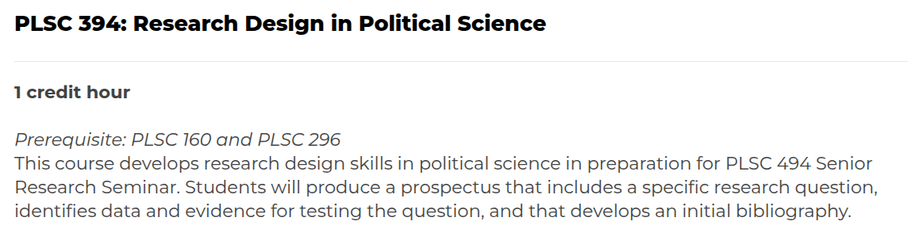

## Today's Agenda {background-image="Images/Background-Rally_v2.png" .center}

```{r}
# background-size="1920px 1080px"
library(tidyverse)
library(readxl)
```

<br>

::: {.r-fit-text}

**Practice Designing "Good" Research Questions**

- Evaluating the research questions from PLSC 394

:::

<br>

::: r-stack
Justin Leinaweaver (Spring 2026)
:::

::: notes
Prep for Class

1. Make sure you have the P394 research questions

<br>

Over the last few weeks we've been reviewing the research question component of a research proposal

- Why do we need them?

- What makes a "good" research question?

- And how do we generate new research questions?

<br>

**SLIDE**: We are not alone in this exercise!

:::


## {background-image="Images/Background-Rally_v2.png"  .center}

```{r, fig.align='center'}

```

::: notes

Currently in the Research Design class, a group of juniors in our department are working hard to design and execute a research project

- Today we get a chance to help them do it!

<br>

This will give you a chance to see first-hand an exercise that you will be taking on in a few years

<br>

**SLIDE**: The assignment prompt for 394

:::


## {background-image="Images/Background-Rally_v2.png"  .center}

::: {.r-fit-text}

**The Prompt**

1. What is your research question?

2. What brought you to this topic? 

3. Why should we care about it?

:::

::: notes

This is the assignment prompt Dr. VanDenBerg gave his students

- Our job today will be to review and evaluate those questions then to provide feedback to those students

- My hope is that for each question we can give them something useful in terms of what we like and what needs clarification or revising

<br>

**SLIDE**: Our criteria

:::


## Science Requires Research Questions {background-image="Images/Background-Rally_v2.png" .center}

<br>

A research question **focuses** your work, **drives** your progress and let's you know when you're **done**

<br>

A good question...

- is interesting, important, controversial, brief, direct, doable and puzzling (Baglione 2019)

- considers potential results, feasibility,  scale and design (Huntington-Klein 2022)

::: notes

We'll use the criteria from the readings to help guide our evaluations

- **Any questions on the criteria before we apply them?**

<br>

Ok, everybody take 2 minutes and read through all of the questions in the document on Canvas

- Don't read their answers to the other prompts, just focus on the questions themselves

- Go!

<br>

Alright, talk to me about the questions you just read

- **Generally speaking, where they are in the process of developing a research project?**

<br>

Let's practice generating useful feedback as a group

- Everybody read all the info we were given by RQ1 and get ready to report back your evaluation

<br>

*ON BOARD*

1. **What is the variation they are trying to explain? What is the outcome?**

2. **Give me a MINIMUM of THREE things you like about the question!**

    - This might be hard, but you'd be suprised how this helps the researcher understand how other people see their topic
    
    - Can you draw on the Baglione criteria for this?
    
3. **Give me a MINIMUM of THREE concerns you would have if I asked YOU to complete this project**

    - Remember, 394 is setting up a COMPLETED project in 494
    
    - Make sure they see the roadblocks you see!
    
4. **Give me a few alternative versions of the question**

    - These don't have to be better, just slight tweaks or big swings

<br>

**Questions on the process?**

<br>

**SLIDE x 1** *If you can easily assign 3+ 160 students to each question*

**SLIDE x 2** *If you have a ton of 394 questions*

:::


## {background-image="Images/Background-Rally_v2.png" .center}

**A good question...**

- is interesting, important, controversial, brief, direct, doable and puzzling (Baglione 2019)
- considers potential results, feasibility,  scale and design (Huntington-Klein 2022)

**Your assignment:**

1. What is the outcome?
2. THREE strengths
3. THREE potential roadblocks
4. TWO revisions of the question

::: notes

*Split glass into groups, one group per submitted research question*

- Go sit with your group!

<br>

GROUPS, take five minutes to review the submission and get ready to present it to the class

- Keep it simple, give us the question and your reaction to it

- We'll then work together to decide on the feedback we want to provide

<br>

Ok, time to kick off our discussions

- Each group should take notes on their assigned question

- At the end of class, each group will clean up the feedback and add it directly to the Google Doc

- *PRESENT and DISCUSS each*

:::


## {background-image="Images/Background-Rally_v2.png" .center}

**A good question...**

- is interesting, important, controversial, brief, direct, doable and puzzling (Baglione 2019)
- considers potential results, feasibility,  scale and design (Huntington-Klein 2022)

**Your assignment:**

1. What is the outcome?
2. THREE strengths
3. THREE potential roadblocks
4. TWO revisions of the question

::: notes

*Group size depends on number of students and number of questions...*

- *May end up being groups each having more than one question to work on*

SP26 plan on the fly

- 13 questions, 23 students

- We did one question as a class, so 12 to distribute

- It's a lot of work per question (if done well), so 2 questions per group and each group gets more people (Class preferred that to smaller groups focused on one question each)

- 6 groups (most of 4, one of 3), 2 questions per group


:::


## For Class After Spring Break {background-image="Images/Background-Rally_v2.png" .center}

<br>

**Gathering the Literature for your Proposal**

- Find THREE political science research articles that aim to answer your RQ

- Aim for three DIFFERENT answers!

- Details on Canvas

::: notes

*Read the slide*

- Everybody open the Canvas post and let me know if you have any questions on the assignment

<br>

**Questions on the assignment?**

<br>

Canvas ASSIGNMENT: Gathering the Literature (I) (10pts)

Find THREE political science research articles that each:

- Aim to answer your chosen RQ (or, at least, are focused on explaining the same outcome),
- Has a pdf that you can access, and
- Is published in a journal on one of the Google Scholar "top" 20 lists (note: you can email me for permission to add articles from journals outside this list)

For each article you find:

1. Import it into Zotero and save it in a new "collection" in your library named "P160 Project"
2. Clean up the relevant bibliography fields in Zotero (if needed)
3. Download and save the pdf on your computer

Submit to Canvas:

1. What is your RQ?
2. The APA citations for your three articles, and
3. Explain why you've submitted EACH article (e.g. how it connects to your RQ or broader topic) (3+ sentences minimum per article)

:::