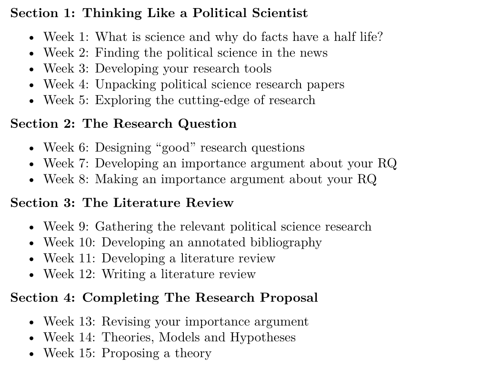

## Today's Agenda {background-image="Images/Background-Rally_v2.png" .center}

```{r}
# background-size="1920px 1080px"
library(tidyverse)
library(readxl)
```

<br>

::: {.r-fit-text}

**Designing a Research Proposal**

- Gathering the academic literature

:::

<br>

::: r-stack
Justin Leinaweaver (Spring 2026)
:::

::: notes
Prep for Class

1. Review Canvas submissions

2. NOTE: NEXT class we will have a discussion about the risks of moving away from the top-20 journals. For today they should be focused only on those!

<br>

Welcome back from break, Let's recap!

- We started our work in this class unpacking the "science" in political science and discussing the half-life of facts

- **SLIDE**

:::


## The Science in Political Science {background-image="Images/Background-Rally_v2.png" .center}

::: {.incremental}
1. Science is a process for converting empirical observations into knowledge (e.g. the "why" of it all)

2. The scientific method prioritizes transparency and replicatability

3. ALL facts have a half-life which makes higher quality facts more valuable

4. Science is never finished, so, be humble in your conclusions
:::

::: notes

*Read slide*

<br>

Science is the process of generating knowledge based on empirical observations

- That means a good social scientist is a well informed social scientist

- So we next shifted to reflecting on our individual news diets

- **SLIDE**

:::


## {background-image="Images/Background-Rally_v2.png" .center}

:::: {.r-fit-text}
**Reflecting on your News Diet**

1. Be curious!

2. Garbage in, garbage out

3. Focus on the NEWS and not the OPINION

4. Explaining "why" requires science

::::

::: notes

I sincerely hope each of you has given some thought, and maybe even made some efforts, to make your news diets "healthier"!

<br>

**SLIDE**: We then transitioned into developing your research tools

:::


## {background-image="Images/Background-Rally_v2.png" .center}

:::: {.r-fit-text}

**Developing your Research Tools**

::: {.incremental}

- Using bibliography managers

- Finding for academic literature

- Structuring an argument paper

- Unpacking and analyzing research papers

:::
::::

::: notes

*Step through items on slide*

<br>

From this point we shifted our focus to helping each of you design a research proposal

- **SLIDE**: And that started with a research question

:::


## Research Questions {background-image="Images/Background-Rally_v2.png" .center}

<br>

A research question **focuses** your work, **drives** your progress and let's you know when you're **done**

<br>

### A good question...

- is interesting, important, controversial, brief, direct, doable and puzzling (Baglione 2019)

- considers potential results, feasibility,  scale and design (Huntington-Klein 2022)

::: notes

*Read slide*

<br>

**SLIDE**: And that took us to your first paper for the class

:::


##  {background-image="Images/Background-Rally_v2.png" .center}

::: {.r-fit-text}
**Proposal Paper 1: Important Research Question**
:::

<br>

**Assignment Prompt**

- What is the research question motivating your proposal and why is it important?

::: notes

This first paper represents the beginning of your research proposal.

<br>

The next section of our class shifts our focus to the next key component of your research proposal

- **SLIDE**: The literature review!

:::


## Course Outline {background-image="Images/Background-Rally_v2.png" .center}

{style="display: block; margin: 0 auto"}

::: notes

The literature review is the section of your proposal where you connect your work explicitly to the established research

- This is where you make clear we all "stand on the shoulders of giants!"

<br>

Essentially, you will each be writing an argument in this section that presents and organizes the competing answers to your research question in the literature.

- No rush, we'll get there!

<br>

**SLIDE**: But first, we have to collect the literature!

:::


## {background-image="Images/Background-Rally_v2.png" .center}

::: {.r-fit-text}
**Academic Literature Search Debriefing**
:::

<br>

::: {.incremental}
1. Tell your partner your RQ,

2. Explain your search process, and

3. As briefly as possible explain the three DIFFERENT answers you found
:::
::: notes

For today each of you were tasked with finding THREE political science research articles that answer your RQ

- The aim was to focus on the top journals AND to gather three DIFFERENT answers to the question

<br>

Today I want us to debrief each other on the exercise

- I'd like us to learn from what you did and how you did it!

<br>

Just to warm up, I'd like you to pair off

- Think of this like a chance to focus in on your project before we discuss it as a class

<br>

**REVEAL x 3**: Your task

- Go!

<br>

Good warm-up!

- **SLIDE**: Now let's widen this debriefing out

:::


## {background-image="Images/Background-Rally_v2.png" .center}

::: {.r-fit-text}
**Academic Literature Search Debriefing**
:::

<br>

::: {.fragment}

1. Tell us your RQ

2. How did you search for answers?

3. BRIEFLY, describe the three DIFFERENT answers you found

4. What challenges do you face for finding more literature?

:::

::: notes

**REVEAL**: Slight tweak to the prompts

- I want each of you to report back on your process and findings

- This is our chance to learn a ton about the world, AND 

- To help each other in the next steps of the lit review!

<br>

*Let this be led by the most eager. It's up to each of them to take the initiative!*

- *PRESENT and DISCUSS each*

<br>

**SLIDE**: Assignment for next class

:::


## For Next Class {background-image="Images/Background-Rally_v2.png" .center}

<br>

**Gathering the Literature for your Proposal**

- Find **THREE MORE** political science research articles that aim to answer your RQ

- Details on Canvas

::: notes

*Read slide*

<br>

**Questions on the assignment or anything from today?**

- Everybody get to work on this in class!

<br>

Canvas ASSIGNMENT: Gathering the Literature (II) (10pts)

Find THREE MORE political science research articles that each:

- Aim to answer your chosen RQ (or, at least, are focused on explaining the same outcome),
- Has a pdf that you can access, and
- Is published in a journal on one of the Google Scholar "top" 20 lists (note: you can email me for permission to add articles from journals outside this list)

For each article you find:

1. Import it into Zotero and save it in a new "collection" in your library named "P160 Project"
2. Clean up the relevant bibliography fields in Zotero (if needed)
3. Download and save the pdf on your computer

Submit to Canvas:

1. What is your RQ?
2. The APA citations for your three articles, and
3. Explain why you've submitted EACH article (e.g. how it connects to your RQ or broader topic) (3+ sentences minimum per article)

:::